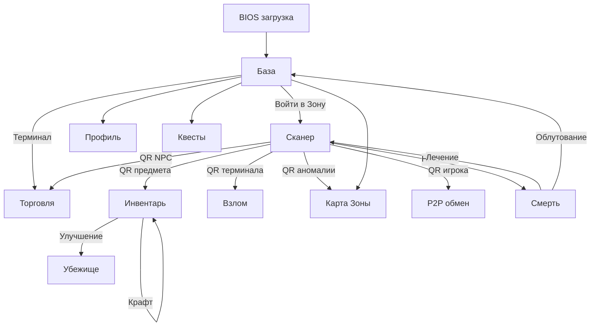
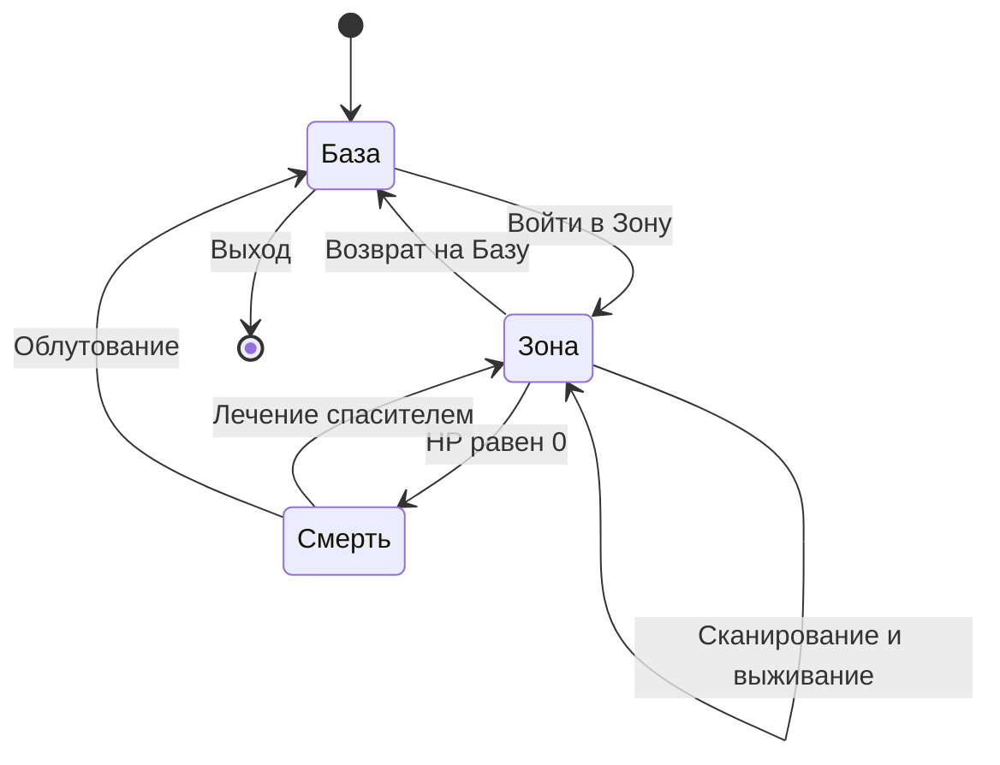

# Wasteland PDA [Alfa 0.2]

Постапокалиптическая PWA-игра «ГРИМ-СЕТЬ» — выживание в Зоне с QR-кодами,
крафтом, квестами, торговлей, картой и CRT-терминальным интерфейсом.

## Принципы проекта

- **Чистый HTML / CSS / JS.** Никакого Node.js, npm, bundler'ов и `package.json`.
- **Модульные исходники** в `src/`, которые **схлопываются конкатенацией** в единый
  `index.html`.
- **Сборка выполняется в браузере** через [`build.html`](build.html) — он читает
  файлы из `src/` через `fetch`, склеивает их и отдаёт готовый `index.html` на скачивание.
- **Функционал не меняется** — это рефакторинг структуры, а не переписывание логики.

## Основные требования

Требования выведены непосредственно из текущей реализации кода.

### Окружение

- Современный браузер с поддержкой перечисленных ниже API.
- **Серверная часть отсутствует** — вся игра выполняется на клиенте.
- **Node.js, npm, `package.json` не используются** — сборка идёт в браузере.
- Для PWA-режима и доступа к камере требуется **HTTPS или `localhost`**.

### Браузерные API

| API | Где используется | Обязательность |
|---|---|---|
| `localStorage` | Сохранение прогресса ([`saveState()`](src/js/core/utils.js:54)) | Обязательно |
| `Web Audio API` | Процедурный звук: гейгер, сердцебиение, сирена ([`playSound()`](src/js/core/audio.js:145)) | Обязательно |
| `Canvas 2D` | Генерация QR ([`generateQR()`](src/js/core/qr.js:1)), фото-модуль | Обязательно |
| `Pointer / Touch Events` | Drag & drop меток на карте ([`map.js`](src/js/logic/map.js:1)) | Обязательно |
| `Service Worker` | Офлайн-кэш ([`sw.js`](sw.js:1)) | Обязательно для PWA |
| `getUserMedia` | QR-сканер камерой ([`Html5Qrcode`](src/js/vendor/html5-qrcode.js:1)) | Обязательно для сканирования |
| `Web Share API` | Отправка фото из фото-модуля ([`profile.js`](src/js/views/profile.js:1)) | Опционально |

> **Офлайн-сканер.** Библиотека камеры кэшируется Service Worker'ом. При первом
> запуске без интернета камера недоступна — предусмотрен **ручной ввод кодов**.

### Архитектурные ограничения

- Код использует **глобальную область видимости** — ES-модули (`import`/`export`) не применяются.
- **Порядок конкатенации критичен**: зависимости объявляются раньше использования.
- Все игровые функции вызываются из HTML через `onclick` — имена должны быть глобальными.

### Игровые лимиты и тайминги

| Параметр | Значение | Источник |
|---|---|---|
| Базовое здоровье | 100 HP | [`constants.js`](src/js/config/constants.js:1) |
| Максимальный голод | 100 | [`constants.js`](src/js/config/constants.js:1) |
| Максимальная радиация | 100 | [`constants.js`](src/js/config/constants.js:1) |
| Размер рюкзака | 30 | [`constants.js`](src/js/config/constants.js:1) |
| Активных квестов одновременно | не более 2 | [`acceptQuest()`](src/js/logic/quests.js:146) |
| Слотов обычных квестов | 5 | [`renderQuests()`](src/js/logic/quests.js:1) |
| Особые контракты | открываются после 5 выполненных | [`quests.js`](src/js/logic/quests.js:110) |
| Время инфицирования | 5 минут | [`constants.js`](src/js/config/constants.js:1) |
| Время зомби | 10 минут | [`constants.js`](src/js/config/constants.js:1) |
| Интервал пси-выброса | раз в час | [`constants.js`](src/js/config/constants.js:1) |
| Время на укрытие при выбросе | 4 минуты | [`blowout.js`](src/js/logic/blowout.js:1) |
| Кулдаун повторного сканирования QR | 5 / 10 минут | [`scan.js`](src/js/logic/scan.js:1) |
| Блокировка взлома после провала | 2 часа | [`hacking.js`](src/js/logic/hacking.js:135) |
| Блокировка ПДА при аресте | 10 минут | [`handleArrestScan()`](src/js/logic/roles.js:61) |
| Ставки слот-машины | 5–100 | [`slots.js`](src/js/logic/slots.js:1) |
| Цикл случайных событий Зоны | 60 секунд | [`events.js`](src/js/logic/events.js:298) |

## Игровые механики

### Карма

Определяется функцией [`getKarmaStatus()`](src/js/core/utils.js:6):

| Диапазон `karma_score` | Статус | Эффекты |
|---|---|---|
| `>= +3` | **ГЕРОЙ** | Иммунитет к накоплению радиации, подсветка `hero-glow` |
| `от -2 до +2` | **ВЫЖИВШИЙ** | Базовые правила, доступ на Базу Выживших |
| `<= -3` | **БАНДИТ** | Тип трупа «бандит», доступ в Лагерь Бандитов, множитель цен 0.7 |

Карма растёт при лечении выживших и падает при мародёрстве и нападениях.

### Репутация NPC

Уровень считается функцией [`getNpcRepLevel()`](src/js/config/npc.js:15): **20 очков = 1 уровень**, максимум **Ур. 10**.

- **Доктор Кроу** — каждый уровень даёт **+10% к максимальному HP** ([`getMaxHp()`](src/js/core/utils.js:12)) и **скидку 10% на лечение**; на Ур. 10 лечение бесплатно ([`buyHeal()`](src/js/logic/trade.js:228)).

### Роли игрока

| Роль | Как получить | Эффект |
|---|---|---|
| **Безработный** | По умолчанию | Нет бонусов |
| **Рабочий** | Назначается администратором | Жалование **+3 💎/мин** в Зоне |
| **Военный** | Назначается администратором | Жалование **+5 💎/мин**, ордер на арест, премия **+100 💎** за фиксацию бандита |
| **Хакер Пустошей** | Пасхалка: 5 кликов по заголовку Базы | Секретный доступ ([`registerHackClick()`](src/js/views/scan.js:92)) |

### Убежище

Пять уровней улучшения ([`SHELTER_UPGRADES`](src/js/config/upgrades.js:8)):

| Ур. | Название | Бонус |
|---|---|---|
| 1 | Палатка | Сытость расходуется на 10% медленнее |
| 2 | Землянка | Радиация накапливается на 10% медленнее |
| 3 | Деревянный бункер | Оружие изнашивается на 10% медленнее |
| 4 | Бетонный бункер | Максимальное здоровье +10% |
| 5 | Укреплённый форпост | Регенерация +1 HP/мин в Зоне, вес рюкзака +3 кг |

### NPC и торговые точки

Из [`NPC_DB`](src/js/config/npc.js:5):

| Ключ | Имя | Покупает | Продаёт | Особенности |
|---|---|---|---|---|
| `npc_eng` | Инженер Михалыч | junk, gear | junk, gear | — |
| `npc_med` | Доктор Кроу | med | med | Лечение, скидки по репутации |
| `npc_trad` | Торговец Сидорович | weapon, gear, artifact | weapon, gear | — |
| `npc_bar` | Бармен Джо | food | food | — |
| `npc_base` | ТЕРМИНАЛ БАЗЫ | — | — | Только для Выживших, множитель 1.0 |
| `npc_bandit_base` | ЛАГЕРЬ БАНДИТОВ | — | — | Только для Бандитов, множитель 0.7 |

## Предметы и их характеристики

База предметов строится процедурно в [`items.js`](src/js/config/items.js:8). У каждого предмета есть `name`, `val` (стоимость в 💎), `size` (вес) и `cat` (категория).

### Категории предметов

| Категория | Префикс ключа | Кол-во | Стоимость | Вес | Доп. параметры |
|---|---|---|---|---|---|
| Еда | `food_` | 26 | 5–25 | 1–2 | `feed` 15–35 (сытость) |
| Снаряжение | `gear_` | 26 | 20–100 | 2–4 | — |
| Медикаменты | `med_` | 24 | 30–150 | 1–2 | `heal` 20–80 (HP) |
| Оружие | `wpn_` | 24 | 50–250 | 2–5 | Прочность, износ |
| Хлам | `junk_` | 27 | 2–15 | 1–2 | Материал для крафта |

### Особые предметы

**Жетоны** (категория `token`):

| Ключ | Название | Стоимость |
|---|---|---|
| `token_bandit` | Жетон бандита | 300 💎 |
| `token_survivor` | Жетон выжившего | 350 💎 |
| `token_military` | Жетон военного | 500 💎 |

**Артефакты** (категория `artifact`):

| Ключ | Название | Стоимость | Вес |
|---|---|---|---|
| `art_1` | Артефакт «Капля» | 500 💎 | 1 |
| `art_2` | Артефакт «Слизь» | 800 💎 | 1 |
| `art_3` | Артефакт «Пустышка» | 1200 💎 | 2 |

**Специальное снаряжение** (категория `eq`, вес 0):

| Ключ | Название | Стоимость | Эффект |
|---|---|---|---|
| `eq_rad` | Свинцовый плащ | 300 💎 | Радиация снижена в 2 раза |
| `eq_gas` | Противогаз ГП-5 | 250 💎 | Накопление радиации −60% |
| `eq_hunger` | Био-синтезатор питания | 300 💎 | Расход сытости в 3 раза медленнее |
| `eq_storm` | Плащ «Шторм» | 400 💎 | Иммунитет к бурям и спорам |
| `eq_anom` | Детектор «Велес» | 500 💎 | Повышает шанс успешного взятия аномалии |
| `eq_trade` | Торговый чип | 450 💎 | Цены −25%, лечение за 35 💎 |
| `eq_pass_base` | Поддельный ID базы | 600 💎 | Бандитам — вход на Базу Выживших |
| `eq_pass_camp` | Вексель Бандитов | 600 💎 | Выжившим — вход в Лагерь Бандитов |

**Расходники с антирад-эффектом:**

| Ключ | Название | Эффект |
|---|---|---|
| `med_2` | Антирадин | `radCure: 50` |
| `med_6` | Рад-Х | `radCure: 25` |
| `food_9` | Яблоко | `radCure: 10` |
| `food_10` | Кукуруза | `radCure: 15` |
| `food_17` | Консервы | `radCure: 15` |

## Структура проекта

```
PDA_GAME/
├── index.html              # Собранный (готовый к запуску) файл — результат сборки
├── build.html              # Браузерный сборщик (открыть в браузере → скачать index.html)
├── manifest.json           # PWA-манифест
├── sw.js                   # Service Worker (офлайн-кэш)
├── README.md               # Этот файл
│
├── src/
│   ├── index.template.html # Шаблон с плейсхолдерами {{CSS}}, {{VIEWS}}, {{HUD}},
│   │                       # {{EVENT_BANNER}}, {{NAV}}, {{OVERLAYS}}, {{JS}}
│   │
│   ├── css/                # Стили, разбитые по назначению
│   │   ├── 01-base.css         # Переменные, шрифты, сброс, body
│   │   ├── 02-layout.css       # CRT-оверлеи, #screen-content, #hud, навигация
│   │   ├── 03-components.css   # Кнопки, карточки, инпуты, баннеры
│   │   ├── 04-views.css        # Стили конкретных вьюх
│   │   └── 05-animations.css   # keyframes, анимации
│   │
│   ├── html/
│   │   ├── views/          # Статичная разметка вьюх (без логики)
│   │   │   ├── base.html
│   │   │   ├── dead.html
│   │   │   ├── scan.html
│   │   │   ├── inventory.html
│   │   │   ├── quests.html
│   │   │   ├── map.html
│   │   │   ├── profile.html
│   │   │   ├── shelter.html
│   │   │   ├── hacking.html
│   │   │   ├── trade.html
│   │   │   ├── hud.html        # Верхний HUD (HP, голод, радиация, кредиты)
│   │   │   ├── event-banner.html  # Баннер событий Зоны
│   │   │   └── nav.html        # Нижняя навигация
│   │   │
│   │   └── overlays/
│   │       └── trade-modal.html   # Модальное окно P2P-торговли
│   │
│   ├── js/
│   │   ├── vendor/         # Вендорные библиотеки (как есть)
│   │   │   ├── html5-qrcode.js
│   │   │   └── qrcode.js
│   │   │
│   │   ├── config/         # Константы и статические данные
│   │   │   ├── constants.js    # Цвета, лимиты, префиксы QR, ключи localStorage
│   │   │   ├── items.js        # ITEMS_DB, генератор предметов
│   │   │   ├── npc.js          # NPC_DB, getNpcRepLevel
│   │   │   └── upgrades.js     # SHELTER_UPGRADES
│   │   │
│   │   ├── state/
│   │   │   ├── player.js       # Объект player, миграция сохранений
│   │   │   └── globals.js      # Глобальные переменные (scanner, таймеры)
│   │   │
│   │   ├── core/           # Базовые подсистемы
│   │   │   ├── audio.js        # playSound, гейгер, сердцебиение, BIOS-boot
│   │   │   ├── utils.js        # getKarmaStatus, getMaxHp, getRadMultiplier,
│   │   │   │                   # formatSurvivalTime, showBanner, saveState
│   │   │   └── qr.js           # generateQR
│   │   │
│   │   ├── logic/          # Игровая логика (без DOM-разметки)
│   │   │   ├── scan.js         # handleScan, handleDeadScan
│   │   │   ├── inventory.js    # Использование, перенос, крафт
│   │   │   ├── quests.js       # Контракты, особые контракты
│   │   │   ├── trade.js        # Торговля с NPC
│   │   │   ├── shelter.js      # Улучшение убежища
│   │   │   ├── hacking.js      # Мини-игра дешифратора
│   │   │   ├── map.js          # Карта Зоны, редактор меток
│   │   │   ├── events.js       # Циклы выживания и события Зоны
│   │   │   ├── blowout.js      # Пси-выброс
│   │   │   ├── slots.js        # Слот-машина
│   │   │   ├── p2p.js          # P2P-торговля через QR
│   │   │   ├── roles.js        # Арест, фиксация бандитов, возврат на Базу
│   │   │   ├── equipment.js    # Оружие, ремонт, экипировка
│   │   │   └── admin.js        # adminLogin, factoryReset
│   │   │
│   │   ├── views/          # Рендеринг вьюх (DOM)
│   │   │   ├── navigation.js   # switchView, updateHUD
│   │   │   ├── base.js
│   │   │   ├── dead.js
│   │   │   ├── scan.js
│   │   │   ├── inventory.js
│   │   │   ├── quests.js
│   │   │   ├── map.js
│   │   │   ├── profile.js
│   │   │   ├── shelter.js
│   │   │   ├── hacking.js
│   │   │   └── trade.js
│   │   │
│   │   └── main.js         # Точка входа: init(), привязка событий, PWA
│   │
│   └── assets/
│       └── zone_map.jpg    # Карта Зоны
```

## Как собрать

1. Откройте [`build.html`](build.html) в браузере (двойной клик или через локальный сервер).
2. Нажмите **«СОБРАТЬ»** — сборщик прочитает все файлы из `src/` в правильном порядке.
3. Нажмите **«СКАЧАТЬ index.html»** и положите полученный файл в корень проекта,
   заменив старый.

> Для работы `fetch` при открытии `build.html` напрямую с диска (`file://`) браузер
> может блокировать чтение. В этом случае запустите локальный сервер, например:
> `python3 -m http.server 8000` и откройте `http://localhost:8000/build.html`.

## Порядок конкатенации

Сборщик склеивает файлы строго в порядке из [`build.html`](build.html:86):

1. **CSS** — [`01-base.css`](src/css/01-base.css:1) → [`02-layout.css`](src/css/02-layout.css:1) →
   [`03-components.css`](src/css/03-components.css:1) → [`04-views.css`](src/css/04-views.css:1) →
   [`05-animations.css`](src/css/05-animations.css:1).
2. **HTML-вьюхи** — base → dead → scan → inventory → quests → map → profile →
   shelter → hacking → trade.
3. **HUD** — [`hud.html`](src/html/views/hud.html:1).
4. **Баннер событий** — [`event-banner.html`](src/html/views/event-banner.html:1).
5. **Навигация** — [`nav.html`](src/html/views/nav.html:1).
6. **Оверлеи** — [`trade-modal.html`](src/html/overlays/trade-modal.html:1).
7. **JS** — vendor → config → state → core → logic → views → main.

Порядок JS критичен: код использует глобальные функции и объекты (без ES-модулей),
поэтому зависимости должны быть объявлены раньше использования.

## Запуск игры

Откройте собранный `index.html` в браузере. Для полноценной работы PWA и камеры
(QR-сканер) рекомендуется HTTPS или `localhost`.

## Ключевые пользовательские сценарии

### 1. Первый запуск и вход в Зону

1. При открытии проигрывается **BIOS-загрузка** ([`runBootSequence()`](src/js/core/audio.js:98)).
2. Открывается экран **Базы** — ввод позывного ([`saveBaseCallsign()`](src/js/views/base.js:1)).
3. Нажатие «ВОЙТИ В ЗОНУ» → [`startGameFromBase()`](src/js/views/base.js:1) → `player.inBase = false`.
4. Запускаются игровые циклы: голод, радиация, сердцебиение, события Зоны.

**Пример:** игрок вводит позывной `СТАЛКЕР-01`, нажимает «ВОЙТИ В ЗОНУ» и попадает на экран Сканера.

### 2. Сканирование QR-кода

1. На экране **Сканера** нажать «НАЧАТЬ СКАНИРОВАНИЕ» ([`main.js`](src/js/main.js:41)).
2. Камера распознаёт QR → [`handleScan()`](src/js/logic/scan.js:1) разбирает префикс.
3. Результат выводится в блок `scan-result`, применяются эффекты.

**Пример:** скан `item_wpn_10` → в рюкзак добавляется оружие; скан `med_2` → антирадин;
скан `heal:СПАСАТЕЛЬ` → восстановление HP.

### 3. Инвентарь и крафт

1. Экран **Инвентаря** ([`renderInventory()`](src/js/logic/inventory.js:1)).
2. Быстрое использование расходников ([`quickUseItem()`](src/js/logic/inventory.js:1)).
3. Перенос предметов в сейф ([`moveToSafe()`](src/js/logic/inventory.js:1)).
4. Крафт из хлама ([`renderCraftBox()`](src/js/logic/inventory.js:1)).

**Пример:** игрок использует аптечку при HP 40 → HP восстанавливается; переносит
артефакты в сейф, чтобы не потерять при смерти.

### 4. Квесты

1. Экран **Квестов** ([`renderQuests()`](src/js/logic/quests.js:1)).
2. Доступно 5 обычных контрактов; принять можно не более 2 ([`acceptQuest()`](src/js/logic/quests.js:146)).
3. После 5 выполненных открываются **особые контракты** ([`acceptSpecialQuest()`](src/js/logic/quests.js:160)).
4. Отмена контракта стоит 10 💎 ([`abandonQuest()`](src/js/logic/quests.js:171)).

**Пример:** контракт «Собрать 10 жетонов мародёров» → награда 5850 💎.

### 5. Торговля с NPC

1. Скан QR торговца → [`openTrade()`](src/js/logic/trade.js:1).
2. Покупка/продажа ([`buyItem()`](src/js/logic/trade.js:1), [`sellItem()`](src/js/logic/trade.js:220)).
3. Продажа всего ([`sellAllToBase()`](src/js/logic/trade.js:222)).
4. Лечение ([`buyHeal()`](src/js/logic/trade.js:228)) — 50 💎, со скидкой по репутации.

**Пример:** у Доктора Кроу с репутацией Ур. 5 лечение стоит 25 💎 вместо 50.

### 6. P2P-обмен между игроками

1. Игрок А формирует предложение → QR `p2ptrade:sell:...` ([`p2p.js`](src/js/logic/p2p.js:1)).
2. Игрок Б сканирует → подтверждение `p2ptrade:confirm:...`.
3. Обмен фиксируется в `player.processedTradeTxs`.

**Пример:** обмен 3 аптечек на 1 артефакт между двумя ПДА.

### 7. Выживание

- **Голод** падает со временем; при 0 — потеря HP.
- **Радиация** растёт в Зоне; снижается антирадинами и снаряжением ([`getRadMultiplier()`](src/js/core/utils.js:22)).
- **Пси-выброс** ([`blowout.js`](src/js/logic/blowout.js:1)) — нужно успеть в укрытие за 4 минуты.
- **Инфекция** — 5 минут до превращения в зомби.
- **Случайные события** каждые 60 секунд: радиационная буря, токсичные споры,
  нападение мутантов, пылевая буря ([`events.js`](src/js/logic/events.js:298)).

**Пример:** во время пылевой бури оружие теряет 10% прочности; Плащ «Шторм» даёт иммунитет.

### 8. Смерть и возрождение

1. При HP 0 → [`declareDeath()`](src/js/views/dead.js:1) → экран **Смерти**.
2. Генерируется QR трупа: `player_id:...` или `zombie_id:...`.
3. Спаситель сканирует → [`confirmHeal()`](src/js/views/dead.js:110) → 20% HP, инфекция сохраняется.
4. Мародёр сканирует → [`confirmRob()`](src/js/views/dead.js:123) → рюкзак очищается.

**Пример:** игрок погибает, показывает QR; другой игрок сканирует и поднимает его с 20 HP.

### 9. Админ-режим

1. Вход: логин `админ`, пароль `Прайс админ` ([`adminLogin()`](src/js/logic/admin.js:1)).
2. Начисление/списание кредитов ([`adminModifyCredits()`](src/js/logic/roles.js:13)).
3. Смена роли ([`adminSetRole()`](src/js/logic/roles.js:42)).
4. Полный сброс ([`factoryReset()`](src/js/logic/admin.js:1)).

**Пример:** администратор выдаёт роль «Военный» и 1000 💎 для тестирования.

## Экранные формы

### Основные экраны

| № | Экран | Файл разметки | Схематичное описание |
|---|---|---|---|
| 1 | **База** | [`base.html`](src/html/views/base.html:1) | Лобби/пауза. Поле ввода позывного, кнопка «ВОЙТИ В ЗОНУ», доступ к терминалу Базы |
| 2 | **Сканер** | [`scan.html`](src/html/views/scan.html:1) | Окно камеры `#qr-reader`, кнопка старта, поле ручного ввода кода, блок результата `scan-result`, радио |
| 3 | **Инвентарь** | [`inventory.html`](src/html/views/inventory.html:1) | Сетка предметов, блок крафта, кнопки «Использовать», «В сейф», индикатор веса |
| 4 | **Квесты** | [`quests.html`](src/html/views/quests.html:1) | Список активных контрактов, 5 доступных, блок особых контрактов (после 5 выполненных) |
| 5 | **Карта Зоны** | [`map.html`](src/html/views/map.html:1) | Изображение `zone_map.jpg`, метки с drag & drop, редактор меток, загрузка фона |
| 6 | **Профиль** | [`profile.html`](src/html/views/profile.html:1) | Позывной, роль, карма, статистика, арсенал, репутация NPC, фото-модуль с фильтрами |
| 7 | **Убежище** | [`shelter.html`](src/html/views/shelter.html:1) | Текущий уровень, требования апгрейда, кнопка улучшения, Зал Славы |
| 8 | **Взлом** | [`hacking.html`](src/html/views/hacking.html:1) | Консоль `hack-console`, сетка слов `hack-words-grid`, счётчик попыток |
| 9 | **Торговля** | [`trade.html`](src/html/views/trade.html:1) | Список товаров NPC, кнопки «Купить»/«Продать», «Продать всё», «Лечить» |
| 10 | **Смерть / Труп** | [`dead.html`](src/html/views/dead.html:1) | QR трупа, описание статуса, кнопки подтверждения лечения/облутования |

### Служебные слои

| Слой | Файл | Описание |
|---|---|---|
| **HUD** | [`hud.html`](src/html/views/hud.html:1) | Верхняя панель: HP, голод, радиация, кредиты, время выживания |
| **Навигация** | [`nav.html`](src/html/views/nav.html:1) | Нижнее меню переключения вьюх |
| **Баннер событий** | [`event-banner.html`](src/html/views/event-banner.html:1) | Всплывающее уведомление о событиях Зоны |
| **Модалка P2P** | [`trade-modal.html`](src/html/overlays/trade-modal.html:1) | Окно обмена между игроками со встроенным сканером |
| **BIOS-загрузка** | внутри [`index.template.html`](src/index.template.html:1) | Экран `#bios-boot` с текстом `#bios-text` |

## Карта экранов



## Жизненный цикл игрока



## Лицензия

Внутренний игровой проект.
