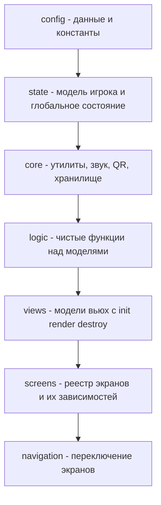

# План упрощения архитектуры Wasteland PDA

## 1. Ответ на главный вопрос: реально ли упростить?

Да, реально. Более того — проект уже находится в состоянии, когда упрощение даёт максимальный эффект при умеренных затратах, потому что:

- Кодовая база небольшая (около 30 JS-файлов, 5 CSS-файлов, 14 HTML-вьюх).
- Уже есть разделение по папкам `config/`, `state/`, `core/`, `logic/`, `views/` — то есть каркас слоёв заложен, но границы слоёв размыты.
- Уже есть документация [`plans/screens-and-entities-map.md`](plans/screens-and-entities-map.md:1) с картой экранов и сущностей — её можно использовать как основу для декларативной модульности.
- Сборка идёт через [`build.html`](build.html:1) конкатенацией — это позволяет менять структуру постепенно, без введения Node.js, npm и bundler'ов.

Главная проблема не в объёме кода, а в **связности**: логика напрямую трогает DOM, вьюхи содержат бизнес-логику, монолитные функции ветвятся по десяткам условий, а порядок загрузки файлов критичен и задан жёсткими списками.

## 2. Диагноз текущей архитектуры

### 2.1. Смешение слоёв

Логика и представление переплетены:

- [`logic/inventory.js`](src/js/logic/inventory.js:1) содержит `renderInventory()` — это рендеринг, а не логика.
- [`logic/trade.js`](src/js/logic/trade.js:123) содержит `renderTradeView()` — тоже рендеринг.
- [`logic/slots.js`](src/js/logic/slots.js:16) содержит `updateSlotUI()` — DOM-манипуляция.
- [`logic/admin.js`](src/js/logic/admin.js:20) содержит `updateAdminVisibility()` — DOM-манипуляция.
- [`views/dead.js`](src/js/views/dead.js:1) содержит `declareDeath()`, `checkDeathState()`, `handleHealItemScan()` — бизнес-логика во вьюхе.
- [`views/base.js`](src/js/views/base.js:5) содержит `renderBaseView()`, который меняет `player.inBase` и вызывает `saveState()` — модель меняется из вьюхи.
- [`views/profile.js`](src/js/views/profile.js:22) инициализирует `player.weapons` и `player.npcRep` прямо в рендере — миграция модели внутри представления.

### 2.2. Дублирование

- `renderInventory()` обслуживает и рюкзак, и сейф почти одинаковым кодом.
- `switchView()` в [`views/navigation.js`](src/js/views/navigation.js:1) переопределяется обёрткой `old_switchView_map` в [`main.js`](src/js/main.js:1) — хрупкий приём.
- `views/inventory.js`, `views/quests.js`, `views/map.js`, `views/shelter.js`, `views/hacking.js` — пустые заглушки, реальный рендер лежит в `logic/*`.

### 2.3. Монолитные функции

- `handleScan()` в [`logic/scan.js`](src/js/logic/scan.js:1) — огромное ветвление по префиксам QR (`item_`, `heal:`, `rob:`, `usb_`, `arrest:`, `p2ptrade:`, `npc_`, `anom_` и т.д.).
- `renderInventory()` в [`logic/inventory.js`](src/js/logic/inventory.js:1).
- `renderTradeView()` в [`logic/trade.js`](src/js/logic/trade.js:123).
- `renderProfile()` в [`views/profile.js`](src/js/views/profile.js:6) — 18 КБ.

### 2.4. Жёсткая сборка

[`build.html`](build.html:1) содержит списки `CSS_FILES`, `VIEW_FILES`, `HUD_FILES`, `EVENT_BANNER_FILES`, `NAV_FILES`, `OVERLAY_FILES`, `JS_FILES`. Порядок JS критичен (vendor → config → state → core → logic → views → main). Добавление модуля требует правки сборщика.

### 2.5. Стили

Пять CSS-файлов задают слои, но во вьюхах много inline-стилей: [`trade.html`](src/html/views/trade.html:4), [`hacking.html`](src/html/views/hacking.html:3), [`profile.html`](src/html/views/profile.html:1), [`shelter.html`](src/html/views/shelter.html:1), [`map.html`](src/html/views/map.html:1), [`dead.html`](src/html/views/dead.html:1), [`base.html`](src/html/views/base.html:1), [`hud.html`](src/html/views/hud.html:1), [`scan.html`](src/html/views/scan.html:1).

### 2.6. Глобальная область видимости

Все функции и переменные глобальны, inline `onclick` в HTML требует глобальных имён. Это ограничение нужно сохранить на переходный период, иначе сломается вся разметка.

## 3. Целевая архитектура

### 3.1. Слои



Правило зависимостей: слой может зависеть только от слоёв выше него. `logic` не знает про DOM. `views` не меняют модель напрямую, а вызывают функции `logic`.

### 3.2. Модель вьюхи

Каждая вьюха становится объектом с единым контрактом:

```js
const InventoryView = {
    id: 'inventory',
    deps: ['logic/inventory', 'logic/equipment'],
    entities: ['player', 'ITEMS_DB'],
    init() {},
    render() {},
    destroy() {}
};
```

### 3.3. Реестр экранов

Экран описывает свои модули, вьюхи, функции и ссылки на другие экраны:

```js
const ScreenRegistry = {
    scan: {
        view: 'ScanView',
        modules: ['logic/scan', 'logic/blowout', 'logic/p2p'],
        entities: ['player', 'ITEMS_DB', 'NPC_DB'],
        actions: ['handleScan', 'startScanner', 'stopScanner'],
        links: ['inventory', 'profile', 'quests', 'map', 'trade', 'hacking']
    },
    trade: {
        view: 'TradeView',
        modules: ['logic/trade'],
        entities: ['player', 'ITEMS_DB', 'NPC_DB'],
        actions: ['buyItem', 'sellItem', 'buyEquipment', 'buyHeal'],
        links: ['scan']
    }
};
```

Навигация и сборка читают этот реестр вместо жёстких списков.

### 3.4. Реестр обработчиков QR

Вместо монолитного `handleScan()` — таблица обработчиков по префиксу:

```js
const ScanHandlers = [
    { prefix: 'item_',    handler: handleItemScan },
    { prefix: 'heal:',    handler: handleHealScan },
    { prefix: 'rob:',     handler: handleRobScan },
    { prefix: 'usb_',     handler: handleUsbScan },
    { prefix: 'arrest:',  handler: handleArrestScan },
    { prefix: 'p2ptrade:',handler: handleP2PTradeScan },
    { prefix: 'npc_',     handler: handleNpcScan },
    { prefix: 'anom_',    handler: handleAnomScan }
];
```

`handleScan()` становится коротким диспетчером: найти обработчик по префиксу и вызвать.

## 4. Этапы работ

### Этап 0. Инварианты и страховка

Что делаем:
- Составляем чек-лист ручного тестирования: загрузка, база, сканирование каждого типа QR, торговля, инвентарь, сейф, квесты, карта, убежище, взлом, смерть, выброс, слоты, профиль, админ-функции.
- Делаем бэкап текущего [`index.html`](index.html:1) и фиксируем рабочее состояние.
- Договариваемся: функционал и внешний вид не меняются, только структура.

Файлы: без изменений кода.
Риск: нулевой.
Проверка: чек-лист пройден на текущей версии.

### Этап 1. Inline-стили в CSS-классы

Что делаем:
- Проходим по всем HTML-вьюхам и заменяем `style="..."` на классы.
- Новые классы добавляем в [`03-components.css`](src/css/03-components.css:1) и [`04-views.css`](src/css/04-views.css:1).
- Динамические стили, которые реально меняются из JS (например `display:none` для переключения блоков), оставляем, но переводим на классы-модификаторы.

Файлы: [`src/html/views/*.html`](src/html/views:1), [`src/html/overlays/trade-modal.html`](src/html/overlays/trade-modal.html:1), [`src/css/03-components.css`](src/css/03-components.css:1), [`src/css/04-views.css`](src/css/04-views.css:1).
Риск: низкий, чистая косметика.
Проверка: визуальное сравнение каждого экрана до и после.

### Этап 2. Реестр модулей вместо жёстких списков

Что делаем:
- Вводим декларативные манифесты: каждый модуль и вьюха объявляет свой `id`, `type`, `deps`, `order`.
- [`build.html`](build.html:1) перестаёт содержать ручные списки и собирает файлы из манифестов.
- Порядок загрузки сохраняется прежним (vendor → config → state → core → logic → views → main).

Файлы: [`build.html`](build.html:1), новые `*.manifest.js` рядом с модулями.
Риск: средний, затрагивает сборку.
Проверка: собранный [`index.html`](index.html:1) побайтово эквивалентен по составу модулей прежнему; чек-лист пройден.

### Этап 3. Разделение слоёв

Что делаем:
- Из `logic/*` выносим всё, что трогает DOM, в соответствующие `views/*`.
- В `logic/*` остаются чистые функции над моделями: принимают `player`, `ITEMS_DB`, `NPC_DB`, возвращают данные или меняют модель.
- Вьюхи вызывают функции логики и сами обновляют DOM.
- Заглушки [`views/inventory.js`](src/js/views/inventory.js:1), [`views/quests.js`](src/js/views/quests.js:1), [`views/map.js`](src/js/views/map.js:1), [`views/shelter.js`](src/js/views/shelter.js:1), [`views/hacking.js`](src/js/views/hacking.js:1) наполняются реальным рендером.
- Из [`views/base.js`](src/js/views/base.js:5) и [`views/profile.js`](src/js/views/profile.js:22) убираем изменение модели, переносим в логику.

Файлы: [`src/js/logic/*`](src/js/logic:1), [`src/js/views/*`](src/js/views:1).
Риск: средний, много перемещений.
Проверка: чек-лист по каждому экрану отдельно, поэкранно.

### Этап 4. Модели вьюх

Что делаем:
- Каждая вьюха становится объектом с `id`, `deps`, `entities`, `init`, `render`, `destroy`.
- [`views/navigation.js`](src/js/views/navigation.js:1) вызывает `render()` у активной вьюхи и `destroy()` у предыдущей.
- Убираем обёртку `old_switchView_map` из [`main.js`](src/js/main.js:1) — карта регистрируется как обычная вьюха.

Файлы: [`src/js/views/*`](src/js/views:1), [`src/js/views/navigation.js`](src/js/views/navigation.js:1), [`src/js/main.js`](src/js/main.js:1).
Риск: средний.
Проверка: переключение всех экранов, отсутствие утечек таймеров и слушателей.

### Этап 5. Разбиение монолитных функций

Что делаем:
- `handleScan()` в [`logic/scan.js`](src/js/logic/scan.js:1) превращаем в диспетчер с таблицей обработчиков по префиксам.
- `renderInventory()` в [`logic/inventory.js`](src/js/logic/inventory.js:1) разбиваем на общий рендер списка и параметры для рюкзака и сейфа.
- `renderTradeView()` в [`logic/trade.js`](src/js/logic/trade.js:123) разбиваем на подфункции: шапка, блок лечения, блок скупки базы, список покупки, список продажи.
- `renderProfile()` в [`views/profile.js`](src/js/views/profile.js:6) разбиваем на блоки: экипировка, оружие, репутация, фото-модуль.

Файлы: [`src/js/logic/scan.js`](src/js/logic/scan.js:1), [`src/js/logic/inventory.js`](src/js/logic/inventory.js:1), [`src/js/logic/trade.js`](src/js/logic/trade.js:123), [`src/js/views/profile.js`](src/js/views/profile.js:6).
Риск: средний, но локальный — каждая функция разбивается отдельно.
Проверка: тестирование конкретной механики после каждого разбиения.

### Этап 6. Модульность экранов

Что делаем:
- Вводим `ScreenRegistry`, где каждый экран объявляет модули, вьюхи, функции, сущности и ссылки на другие экраны.
- Навигация строится из реестра: ссылки на другие экраны берутся из `links`.
- Сборка использует реестр для подключения только нужных модулей экрана.

Файлы: новый `src/js/screens/registry.js`, [`src/js/views/navigation.js`](src/js/views/navigation.js:1), [`build.html`](build.html:1).
Риск: средний.
Проверка: каждый экран открывается, все ссылки работают, лишние модули не подключены.

### Этап 7. Унификация стилей

Что делаем:
- Приводим CSS к слоям: [`01-base.css`](src/css/01-base.css:1), [`02-layout.css`](src/css/02-layout.css:1), [`03-components.css`](src/css/03-components.css:1), [`04-views.css`](src/css/04-views.css:1), [`05-animations.css`](src/css/05-animations.css:1).
- Убираем дубли и мёртвые правила, появившиеся после этапа 1.
- Выносим повторяющиеся значения в CSS-переменные в `:root`.

Файлы: [`src/css/*`](src/css:1).
Риск: низкий.
Проверка: визуальное сравнение всех экранов.

### Этап 8. Финальная проверка и документация

Что делаем:
- Прогон полного чек-листа.
- Обновление [`README.md`](README.md:1) под новую архитектуру.
- Обновление [`plans/screens-and-entities-map.md`](plans/screens-and-entities-map.md:1): экраны, модули, сущности, ссылки.
- Обновление версии кэша в [`sw.js`](sw.js:1).

Файлы: [`README.md`](README.md:1), [`plans/screens-and-entities-map.md`](plans/screens-and-entities-map.md:1), [`sw.js`](sw.js:1).
Риск: нулевой.
Проверка: чек-лист пройден, документация соответствует коду.

## 5. Порядок и совместимость

Этапы идут от низкого риска к среднему:

1. Этап 0 — страховка.
2. Этап 1 — стили, косметика.
3. Этап 2 — сборка, реестр модулей.
4. Этап 3 — разделение слоёв.
5. Этап 4 — модели вьюх.
6. Этап 5 — разбиение монолитов.
7. Этап 6 — модульность экранов.
8. Этап 7 — унификация стилей.
9. Этап 8 — проверка и документация.

Каждый этап самодостаточен: после него приложение работает и проходит чек-лист. Можно остановиться на любом этапе.

Ограничения проекта сохраняются: без Node.js, npm и bundler'ов; без ES-модулей; сборка через [`build.html`](build.html:1); inline `onclick` продолжает работать, потому что функции остаются глобальными на переходный период.

## 6. Что даёт результат

- Логику можно менять, не боясь сломать разметку.
- Вьюхи можно менять, не боясь сломать модель.
- Новый экран добавляется описанием в реестре, а не правкой сборщика.
- Монолитные функции становятся набором маленьких, которые легко тестировать.
- Стили перестают дублироваться между HTML и CSS.
