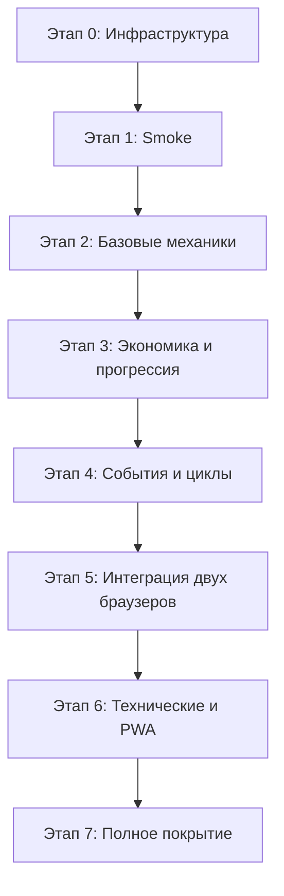

# План 1 — Внедрение Playwright в проект Wasteland PDA

> **Цель:** интегрировать фреймворк Playwright в существующий проект **без изменения бизнес-логики приложения** и обеспечить полное покрытие автотестами всех ключевых сценариев использования.
>
> **Связанный документ:** [`plans/playwright-test-scenarios-plan.md`](plans/playwright-test-scenarios-plan.md) — План 2 (тестовые сценарии).

---

## 1. Анализ текущего состояния проекта

### 1.1. Ключевые факты об архитектуре

| Аспект | Текущее состояние | Следствие для тестов |
|---|---|---|
| Стек | Чистый HTML/CSS/JS, **без Node.js, npm, bundler'ов** | Тестовая инфраструктура должна быть **изолирована** в отдельной папке `tests/` |
| Сборка | Браузерный сборщик [`build.html`](build.html) конкатенирует `src/` → [`index.html`](index.html) | Тесты работают против **собранного** [`index.html`](index.html) |
| Модульность | Глобальная область видимости, **без ES-модулей** | Все функции доступны через `window` — удобно для инъекции состояния |
| Разметка | Inline `onclick` в HTML | Клики по кнопкам работают нативно, без биндингов |
| Навигация | SPA: все `.view` в DOM, переключение классом `active` через [`switchView()`](src/js/views/navigation.js:6) | Проверка активной вьюхи через CSS-класс |
| Состояние | `localStorage` под ключом `wasteland_player` | Инъекция/чтение состояния через `localStorage` |
| Камера | `Html5Qrcode` + `getUserMedia` | Требует **мокирования**; есть fallback — ручной ввод кодов |
| P2P | QR-обмен между двумя браузерами | Требует **двух browser contexts** |
| Service Worker | [`sw.js`](sw.js) кэширует ресурсы | В тестах нужно **отключать** SW для детерминизма |

### 1.2. Точки входа для тестирования (hooks)

| Точка входа | Файл | Назначение в тестах |
|---|---|---|
| `handleScan(code)` | [`src/js/logic/scan.js`](src/js/logic/scan.js:76) | Центральный диспетчер QR — основной вход для сценариев сканирования |
| `submitManualCode()` | [`src/js/logic/scan.js`](src/js/logic/scan.js) | Ручной ввод кода (fallback без камеры) |
| `submitDeadManualCode()` | [`src/js/logic/scan.js`](src/js/logic/scan.js) | Ручной ввод кода на экране смерти |
| `submitHealItemManualCode()` | [`src/js/logic/scan.js`](src/js/logic/scan.js) | Ручной ввод лечебного QR |
| `switchView(name)` | [`src/js/views/navigation.js`](src/js/views/navigation.js:6) | Навигация между вьюхами |
| `player` (глобальный объект) | [`src/js/state/player.js`](src/js/state/player.js) | Инъекция/чтение игрового состояния |
| `saveState()` | [`src/js/core/utils.js`](src/js/core/utils.js) | Персистентность в `localStorage` |
| `init()` | [`src/js/main.js`](src/js/main.js) | Точка входа приложения |

### 1.3. Ключи `localStorage` для проверок

| Ключ | Константа | Содержимое |
|---|---|---|
| `wasteland_player` | `STORAGE_KEY_PLAYER` | Полное состояние игрока (JSON) |
| `pda_heartbeat` | — | Метка присутствия (timestamp) |
| `wasteland_notes` | — | Заметки выживания |
| `pda_zone_markers` | `STORAGE_KEY_MAP_MARKERS` | Метки на карте Зоны |
| `pda_custom_map_bg` | `STORAGE_KEY_MAP_BG` | Кастомный фон карты (dataURL) |

### 1.4. Что требует мокирования

| Механизм | Где используется | Стратегия |
|---|---|---|
| `Html5Qrcode` | [`src/js/views/scan.js`](src/js/views/scan.js:18), [`src/js/logic/scan.js`](src/js/logic/scan.js:385) | Подмена `window.Html5Qrcode` заглушкой через `addInitScript` |
| `getUserMedia` | внутри `Html5Qrcode` | Не вызывается при моке библиотеки |
| `Web Audio API` | [`src/js/core/audio.js`](src/js/core/audio.js) | `AudioContext` уже обёрнут в try/catch; при необходимости — заглушка |
| `alert` / `confirm` / `prompt` | повсеместно | Перехват через `page.on('dialog')` |
| Таймеры игровых циклов | [`src/js/logic/events.js`](src/js/logic/events.js) | `page.clock` (Playwright Clock API) для детерминированного времени |
| `Math.random` | аномалии, слоты, лут | `page.addInitScript` с детерминированным PRNG |

---

## 2. Целевая структура тестовой инфраструктуры

Инфраструктура **полностью изолирована** в папке `tests/` и не затрагивает корень проекта.

```
PDA_GAME/
├── index.html                      # Собранный файл (тестируемый артефакт)
├── build.html                      # Сборщик (не изменяется)
├── src/                            # Исходники (НЕ изменяются)
│
└── tests/                          # ← НОВАЯ изолированная папка
    ├── package.json                # Зависимости только для тестов
    ├── tsconfig.json               # Конфигурация TypeScript
    ├── playwright.config.ts        # Конфигурация Playwright
    ├── .gitignore                  # node_modules, test-results, playwright-report
    │
    ├── e2e/                        # Тесты (спецификации)
    │   ├── smoke/                  # Smoke-тесты
    │   │   ├── boot.spec.ts
    │   │   ├── base-entry.spec.ts
    │   │   └── navigation.spec.ts
    │   ├── regression/             # Регрессионные тесты
    │   │   ├── scan-items.spec.ts
    │   │   ├── scan-anomalies.spec.ts
    │   │   ├── inventory.spec.ts
    │   │   ├── trade.spec.ts
    │   │   ├── quests.spec.ts
    │   │   ├── hacking.spec.ts
    │   │   ├── shelter.spec.ts
    │   │   ├── slots.spec.ts
    │   │   ├── map.spec.ts
    │   │   ├── blowout.spec.ts
    │   │   ├── infection.spec.ts
    │   │   ├── roles.spec.ts
    │   │   └── admin.spec.ts
    │   ├── integration/            # Интеграционные (два браузера)
    │   │   ├── p2p-trade.spec.ts
    │   │   ├── heal-corpse.spec.ts
    │   │   ├── rob-corpse.spec.ts
    │   │   ├── arrest-bandit.spec.ts
    │   │   └── player-id-scan.spec.ts
    │   └── technical/              # Технические
    │       ├── localStorage.spec.ts
    │       ├── offline-pwa.spec.ts
    │       └── easter-eggs.spec.ts
    │
    ├── fixtures/                   # Playwright fixtures
    │   ├── game.fixture.ts         # Базовая фикстура: загрузка игры, моки
    │   ├── player.fixture.ts       # Инъекция состояния игрока
    │   └── two-players.fixture.ts  # Два browser context для P2P
    │
    ├── helpers/                    # Утилиты
    │   ├── game-page.ts            # Page Object: навигация, HUD, вьюхи
    │   ├── scan-helper.ts          # Ввод QR-кодов (ручной ввод / handleScan)
    │   ├── state-helper.ts         # Чтение/запись localStorage, player
    │   ├── mocks.ts                # Моки Html5Qrcode, AudioContext, Math.random
    │   ├── qr-codes.ts             # Генераторы тестовых QR-кодов по префиксам
    │   └── constants.ts            # Ключи localStorage, префиксы, лимиты
    │
    ├── data/                       # Тестовые данные
    │   └── players.ts              # Предустановленные состояния игроков
    │
    └── scripts/
        └── build-game.ts           # Проверка/пересборка index.html перед тестами
```

---

## 3. Пошаговая установка и настройка

### Шаг 1. Создание изолированной тестовой папки

```bash
mkdir -p tests
cd tests
```

### Шаг 2. Инициализация `package.json`

Создать [`tests/package.json`](tests/package.json):

```json
{
  "name": "wasteland-pda-e2e",
  "version": "1.0.0",
  "private": true,
  "description": "E2E-тесты Playwright для Wasteland PDA",
  "scripts": {
    "test": "playwright test",
    "test:smoke": "playwright test e2e/smoke",
    "test:regression": "playwright test e2e/regression",
    "test:integration": "playwright test e2e/integration",
    "test:technical": "playwright test e2e/technical",
    "test:chromium": "playwright test --project=chromium",
    "test:firefox": "playwright test --project=firefox",
    "test:webkit": "playwright test --project=webkit",
    "test:headed": "playwright test --headed",
    "test:ui": "playwright test --ui",
    "test:debug": "playwright test --debug",
    "report": "playwright show-report",
    "typecheck": "tsc --noEmit"
  }
}
```

### Шаг 3. Установка зависимостей

```bash
cd tests
npm install -D @playwright/test typescript @types/node
npx playwright install chromium firefox webkit
```

> **Примечание:** установка браузеров скачивает бинарники Chromium, Firefox и WebKit. Для CI-подобного окружения на Linux может потребоваться `npx playwright install-deps`.

### Шаг 4. Конфигурация TypeScript

Создать [`tests/tsconfig.json`](tests/tsconfig.json):

```json
{
  "compilerOptions": {
    "target": "ES2022",
    "module": "ESNext",
    "moduleResolution": "Bundler",
    "strict": true,
    "esModuleInterop": true,
    "skipLibCheck": true,
    "forceConsistentCasingInFileNames": true,
    "resolveJsonModule": true,
    "noEmit": true,
    "types": ["node"],
    "baseUrl": ".",
    "paths": {
      "@helpers/*": ["helpers/*"],
      "@fixtures/*": ["fixtures/*"],
      "@data/*": ["data/*"]
    }
  },
  "include": ["**/*.ts"]
}
```

### Шаг 5. Конфигурация Playwright

Создать [`tests/playwright.config.ts`](tests/playwright.config.ts):

```ts
import { defineConfig, devices } from '@playwright/test';

const BASE_URL = process.env.BASE_URL ?? 'http://127.0.0.1:8000';

export default defineConfig({
  testDir: './e2e',
  fullyParallel: true,
  forbidOnly: !!process.env.CI,
  retries: process.env.CI ? 1 : 0,
  workers: process.env.CI ? 2 : undefined,
  reporter: [
    ['list'],
    ['html', { open: 'never', outputFolder: 'playwright-report' }],
  ],
  timeout: 30_000,
  expect: { timeout: 5_000 },

  use: {
    baseURL: BASE_URL,
    trace: 'on-first-retry',
    screenshot: 'only-on-failure',
    video: 'retain-on-failure',
    serviceWorkers: 'block',        // отключаем SW для детерминизма
    permissions: [],                // камера не нужна — используем ручной ввод
  },

  projects: [
    { name: 'chromium', use: { ...devices['Desktop Chrome'] } },
    { name: 'firefox',  use: { ...devices['Desktop Firefox'] } },
    { name: 'webkit',   use: { ...devices['Desktop Safari'] } },
  ],

  webServer: {
    command: 'python3 -m http.server 8000',
    cwd: '..',                      // корень проекта PDA_GAME
    url: BASE_URL,
    reuseExistingServer: !process.env.CI,
    timeout: 30_000,
  },
});
```

> **Важно:** `webServer` автоматически поднимает локальный HTTP-сервер в корне проекта, откуда доступен собранный [`index.html`](index.html). Это снимает ограничения `file://` (fetch, Service Worker, localStorage origin).

### Шаг 6. `.gitignore` для тестов

Создать [`tests/.gitignore`](tests/.gitignore):

```
node_modules/
playwright-report/
test-results/
blob-report/
.playwright/
```

### Шаг 7. Проверка установки

```bash
cd tests
npx playwright --version
npm run typecheck
```

---

## 4. Базовые фикстуры и утилиты

### 4.1. Моки (`tests/helpers/mocks.ts`)

Ключевой приём — `page.addInitScript()` для подмены глобалов **до** загрузки приложения.

```ts
import { Page } from '@playwright/test';

/** Заглушка Html5Qrcode: камера не запускается, сканирование не происходит. */
export async function mockQrScanner(page: Page): Promise<void> {
  await page.addInitScript(() => {
    class FakeHtml5Qrcode {
      constructor(_el: string) {}
      start(_cfg: unknown, _opts: unknown, _onSuccess: unknown, _onError: unknown) {
        return Promise.resolve();
      }
      stop() { return Promise.resolve(); }
    }
    (window as any).Html5Qrcode = FakeHtml5Qrcode;
  });
}

/** Детерминированный Math.random (mulberry32). */
export async function mockRandom(page: Page, seed = 42): Promise<void> {
  await page.addInitScript((s: number) => {
    let a = s >>> 0;
    Math.random = () => {
      a |= 0; a = (a + 0x6D2B79F5) | 0;
      let t = Math.imul(a ^ (a >>> 15), 1 | a);
      t = (t + Math.imul(t ^ (t >>> 7), 61 | t)) ^ t;
      return ((t ^ (t >>> 14)) >>> 0) / 4294967296;
    };
  }, seed);
}

/** Заглушка AudioContext (без звука). */
export async function mockAudio(page: Page): Promise<void> {
  await page.addInitScript(() => {
    (window as any).AudioContext = class {
      state = 'running';
      currentTime = 0;
      destination = {};
      createOscillator() { return { connect(){}, start(){}, stop(){}, frequency:{setValueAtTime(){}}, type:'' }; }
      createGain() { return { connect(){}, gain:{setValueAtTime(){}, linearRampToValueAtTime(){}} }; }
      createBiquadFilter() { return { connect(){}, frequency:{setValueAtTime(){}}, type:'' }; }
      resume() { return Promise.resolve(); }
    };
  });
}
```

### 4.2. Хелпер состояния (`tests/helpers/state-helper.ts`)

```ts
import { Page } from '@playwright/test';
import { STORAGE_KEY_PLAYER } from './constants';

export async function seedPlayer(page: Page, patch: Record<string, unknown>): Promise<void> {
  await page.addInitScript(
    ([key, data]) => {
      const base = JSON.parse(localStorage.getItem(key as string) ?? '{}');
      localStorage.setItem(key as string, JSON.stringify({ ...base, ...(data as object) }));
    },
    [STORAGE_KEY_PLAYER, patch] as const,
  );
}

export async function readPlayer(page: Page): Promise<any> {
  return page.evaluate((key) => JSON.parse(localStorage.getItem(key) ?? '{}'), STORAGE_KEY_PLAYER);
}

export async function readStorage(page: Page, key: string): Promise<string | null> {
  return page.evaluate((k) => localStorage.getItem(k), key);
}
```

### 4.3. Хелпер сканирования (`tests/helpers/scan-helper.ts`)

Два подхода: через UI (ручной ввод) и напрямую через `handleScan()`.

```ts
import { Page } from '@playwright/test';

/** Ввод кода через поле ручного ввода на экране сканера. */
export async function scanViaManualInput(page: Page, code: string): Promise<void> {
  await page.evaluate(() => (window as any).switchView('scan'));
  await page.fill('#manual-code', code);
  await page.evaluate(() => (window as any).submitManualCode());
}

/** Прямой вызов диспетчера (быстрее, для регрессионных тестов). */
export async function scanDirect(page: Page, code: string): Promise<void> {
  await page.evaluate((c) => (window as any).handleScan(c), code);
}
```

### 4.4. Генераторы QR-кодов (`tests/helpers/qr-codes.ts`)

```ts
export const QR = {
  item: (id: string) => id,                       // item_/food_/med_/wpn_/junk_/gear_
  loot: () => 'loot',
  npc: (key: string) => key,                      // npc_eng, npc_med, npc_base, ...
  anomaly: (id = 'anom_1') => id,
  safe: (id = 'safe_1') => id,
  usb: (id = 'usb_1') => id,
  term: (id = 'term_1') => id,
  heal: (corpseId: string, name: string) => `heal:${corpseId}:${name}`,
  healItem: (txId: string, itemId: string, heal: number, name: string) =>
    `healitem:${txId}:${itemId}:${heal}:${name}`,
  rob: (type: 'bandit'|'survivor'|'military', id: string, name: string, items: string[], score: number) =>
    `rob:${type}:${id}:${name}:${items.join(',')}:${score}`,
  arrest: (id: string) => `arrest:${id}`,
  banditId: (id: string) => `bandit_id:${id}`,
  playerId: (id: string) => `player_id:${id}`,
  zombieId: (id: string) => `zombie_id:${id}`,
  p2pSell: (payload: string) => `p2ptrade:sell:${payload}`,
  p2pConfirm: (payload: string) => `p2ptrade:confirm:${payload}`,
};
```

### 4.5. Фикстура двух игроков (`tests/fixtures/two-players.fixture.ts`)

Основа интеграционных тестов P2P.

```ts
import { test as base, BrowserContext, Page } from '@playwright/test';

type TwoPlayers = { ctxA: BrowserContext; ctxB: BrowserContext; pageA: Page; pageB: Page };

export const test = base.extend<TwoPlayers>({
  ctxA: async ({ browser }, use) => {
    const ctx = await browser.newContext();
    await use(ctx);
    await ctx.close();
  },
  ctxB: async ({ browser }, use) => {
    const ctx = await browser.newContext();
    await use(ctx);
    await ctx.close();
  },
  pageA: async ({ ctxA }, use) => { await use(await ctxA.newPage()); },
  pageB: async ({ ctxB }, use) => { await use(await ctxB.newPage()); },
});

export { expect } from '@playwright/test';
```

---

## 5. Дорожная карта написания тестов

Порядок продиктован зависимостями: сначала инфраструктура и smoke, затем изолированные механики, затем интеграция.



| Этап | Содержание | Файлы тестов |
|---|---|---|
| **0. Инфраструктура** | `package.json`, `tsconfig`, `playwright.config`, фикстуры, хелперы, моки | `helpers/*`, `fixtures/*` |
| **1. Smoke** | Загрузка, BIOS-boot, вход на Базу, навигация по всем вьюхам | `e2e/smoke/*` |
| **2. Базовые механики** | Сканирование предметов, аномалии, инвентарь, крафт, сейф | `e2e/regression/scan-*.spec.ts`, `inventory.spec.ts` |
| **3. Экономика и прогрессия** | Торговля с NPC, квесты, убежище, слоты, взлом, экипировка | `e2e/regression/trade|quests|shelter|slots|hacking.spec.ts` |
| **4. События и циклы** | Инфекция/зомби, пси-выброс, голод/радиация, карта, радио | `e2e/regression/blowout|infection|map.spec.ts` |
| **5. Интеграция** | P2P-торговля, лечение/ограбление трупа, арест, скан ID | `e2e/integration/*` |
| **6. Технические** | localStorage, офлайн/PWA, пасхалки, админ-режим | `e2e/technical/*`, `e2e/regression/admin.spec.ts` |
| **7. Полное покрытие** | Роли, репутация NPC, карма, граничные случаи, все три браузера | дополнение существующих спеков |

---

## 6. План покрытия

### 6.1. Матрица покрытия по модулям

| Модуль | Файл | Приоритет | Тип тестов |
|---|---|---|---|
| Точка входа / BIOS | [`src/js/main.js`](src/js/main.js), [`src/js/core/audio.js`](src/js/core/audio.js) | P0 | Smoke |
| Навигация / HUD | [`src/js/views/navigation.js`](src/js/views/navigation.js) | P0 | Smoke, Regression |
| Сканирование QR | [`src/js/logic/scan.js`](src/js/logic/scan.js) | P0 | Regression, Integration |
| Инвентарь / крафт / сейф | [`src/js/logic/inventory.js`](src/js/logic/inventory.js) | P0 | Regression |
| Торговля с NPC | [`src/js/logic/trade.js`](src/js/logic/trade.js) | P0 | Regression |
| P2P-торговля | [`src/js/logic/p2p.js`](src/js/logic/p2p.js) | P0 | Integration |
| Экран смерти | [`src/js/views/dead.js`](src/js/views/dead.js) | P0 | Regression, Integration |
| Квесты | [`src/js/logic/quests.js`](src/js/logic/quests.js) | P1 | Regression |
| Убежище | [`src/js/logic/shelter.js`](src/js/logic/shelter.js) | P1 | Regression |
| Взлом | [`src/js/logic/hacking.js`](src/js/logic/hacking.js) | P1 | Regression |
| Слоты | [`src/js/logic/slots.js`](src/js/logic/slots.js) | P1 | Regression |
| Экипировка / ремонт | [`src/js/logic/equipment.js`](src/js/logic/equipment.js) | P1 | Regression |
| События / циклы | [`src/js/logic/events.js`](src/js/logic/events.js) | P1 | Regression |
| Пси-выброс | [`src/js/logic/blowout.js`](src/js/logic/blowout.js) | P1 | Regression |
| Карта / метки | [`src/js/logic/map.js`](src/js/logic/map.js) | P2 | Regression |
| Роли / арест | [`src/js/logic/roles.js`](src/js/logic/roles.js) | P1 | Regression, Integration |
| Админ-режим | [`src/js/logic/admin.js`](src/js/logic/admin.js) | P2 | Regression |
| Профиль | [`src/js/views/profile.js`](src/js/views/profile.js) | P2 | Regression |
| Радио / пасхалки | [`src/js/views/scan.js`](src/js/views/scan.js) | P2 | Technical |
| PWA / офлайн | [`sw.js`](sw.js), [`manifest.json`](manifest.json) | P2 | Technical |

### 6.2. Порядок покрытия

1. **P0 (критический путь):** загрузка → База → сканирование → инвентарь → торговля → смерть/возрождение → P2P.
2. **P1 (основные механики):** квесты, убежище, взлом, слоты, экипировка, события, выброс, роли.
3. **P2 (второстепенное):** карта, профиль, радио, пасхалки, админ, PWA.

---

## 7. Необходимые изменения и дополнения

### 7.1. Изменения в проекте

| Область | Изменение | Обоснование |
|---|---|---|
| Корень проекта | **Не изменяется** | Требование «без изменения логики приложения» |
| `src/` | **Не изменяется** | Тесты работают через публичные глобальные функции |
| `index.html` | Пересобирается через [`build.html`](build.html) при изменениях `src/` | Тесты работают против собранного артефакта |
| `tests/` | **Создаётся** | Изолированная инфраструктура |

> **Принцип:** никаких `data-testid` в разметке и никаких тестовых хуков в коде приложения. Тесты используют существующие `id`, классы и глобальные функции.

### 7.2. Конфигурационные файлы (создаются)

- [`tests/package.json`](tests/package.json) — зависимости и скрипты.
- [`tests/tsconfig.json`](tests/tsconfig.json) — TypeScript.
- [`tests/playwright.config.ts`](tests/playwright.config.ts) — конфигурация Playwright + `webServer`.
- [`tests/.gitignore`](tests/.gitignore) — исключения артефактов.

### 7.3. Структура папок (создаётся)

См. раздел 2 — полное дерево `tests/`.

### 7.4. CI-хуки

По решению пользователя **CI (GitHub Actions) на первом этапе не настраивается** — тесты запускаются локально. При этом конфигурация готова к CI:

- `forbidOnly`, `retries`, `workers` уже учитывают `process.env.CI`.
- `webServer.reuseExistingServer` отключается в CI.
- Для будущего CI достаточно добавить workflow с шагами: `npm ci` → `npx playwright install --with-deps` → `npm test`.

### 7.5. Утилиты (создаются)

- `helpers/game-page.ts` — Page Object (навигация, HUD, вьюхи).
- `helpers/scan-helper.ts` — ввод QR-кодов.
- `helpers/state-helper.ts` — работа с `localStorage` и `player`.
- `helpers/mocks.ts` — моки камеры, аудио, `Math.random`.
- `helpers/qr-codes.ts` — генераторы кодов.
- `helpers/constants.ts` — ключи, префиксы, лимиты.
- `scripts/build-game.ts` — проверка актуальности `index.html`.

### 7.6. Скрипт проверки сборки (`tests/scripts/build-game.ts`)

Опциональная утилита: сравнивает mtime файлов `src/` и `index.html`, предупреждает, если сборка устарела.

```ts
import { statSync, readdirSync } from 'node:fs';
import { join } from 'node:path';

const ROOT = join(__dirname, '..', '..');
const INDEX = join(ROOT, 'index.html');

function newestMtime(dir: string): number {
  let max = 0;
  for (const entry of readdirSync(dir, { withFileTypes: true })) {
    const p = join(dir, entry.name);
    max = Math.max(max, entry.isDirectory() ? newestMtime(p) : statSync(p).mtimeMs);
  }
  return max;
}

const srcMtime = newestMtime(join(ROOT, 'src'));
const indexMtime = statSync(INDEX).mtimeMs;

if (srcMtime > indexMtime) {
  console.warn('⚠️  index.html устарел. Пересоберите через build.html.');
  process.exit(1);
}
console.log('✅ index.html актуален.');
```

---

## 8. Инструкции по установке и настройке окружения

### 8.1. Требования

| Компонент | Версия | Назначение |
|---|---|---|
| Node.js | ≥ 18 LTS | Запуск Playwright |
| npm | ≥ 9 | Управление зависимостями |
| Python 3 | ≥ 3.8 | Локальный HTTP-сервер (`http.server`) |
| Браузеры Playwright | Chromium, Firefox, WebKit | Кросс-браузерное тестирование |

### 8.2. Полная последовательность установки

```bash
# 1. Перейти в корень проекта
cd /Users/dmitrymityunin/IdeaProjects/Bankrupts/PDA_GAME

# 2. Создать тестовую папку
mkdir -p tests && cd tests

# 3. Инициализировать package.json (см. раздел 3, Шаг 2)

# 4. Установить зависимости
npm install -D @playwright/test typescript @types/node

# 5. Установить браузеры
npx playwright install chromium firefox webkit

# 6. Проверить установку
npx playwright --version
npm run typecheck
```

### 8.3. Запуск тестов

```bash
cd tests

# Все тесты во всех браузерах
npm test

# По группам
npm run test:smoke
npm run test:regression
npm run test:integration
npm run test:technical

# По браузерам
npm run test:chromium
npm run test:firefox
npm run test:webkit

# Отладка
npm run test:headed
npm run test:ui
npm run test:debug

# Отчёт
npm run report
```

### 8.4. Переменные окружения

| Переменная | Значение по умолчанию | Назначение |
|---|---|---|
| `BASE_URL` | `http://127.0.0.1:8000` | Адрес локального сервера |
| `CI` | — | Включает CI-режим (retries, workers) |

### 8.5. Устранение типовых проблем

| Проблема | Причина | Решение |
|---|---|---|
| `fetch` блокируется | Открытие через `file://` | Использовать `webServer` (HTTP) |
| Камера недоступна | Нет HTTPS/разрешений | Мок `Html5Qrcode` + ручной ввод |
| Service Worker мешает | Кэш между прогонами | `serviceWorkers: 'block'` в конфиге |
| Нестабильные таймеры | Реальные игровые циклы | `page.clock` + `mockRandom` |
| `localStorage` пуст | Новый контекст | `seedPlayer()` через `addInitScript` |

---

## 9. Критерии готовности внедрения

- [ ] Папка `tests/` создана и изолирована от корня проекта.
- [ ] `package.json`, `tsconfig.json`, `playwright.config.ts`, `.gitignore` созданы.
- [ ] Зависимости и браузеры (Chromium, Firefox, WebKit) установлены.
- [ ] `webServer` автоматически поднимает локальный сервер.
- [ ] Моки камеры, аудио и `Math.random` работают.
- [ ] Фикстуры `game`, `player`, `two-players` доступны.
- [ ] Smoke-тест загрузки приложения проходит во всех трёх браузерах.
- [ ] `index.html` актуален относительно `src/`.

---

## 10. Связь с Планом 2

Данный документ описывает **инфраструктуру и порядок внедрения**. Конкретные тестовые сценарии (бизнес-, интеграционные и технические), их привязка к областям покрытия и подходы к реализации описаны в [`plans/playwright-test-scenarios-plan.md`](plans/playwright-test-scenarios-plan.md).

Каждый сценарий из Плана 2 ссылается на:
- **область покрытия** — модуль из раздела 6.1;
- **подход к реализации** — хелпер/фикстуру из раздела 4;
- **необходимые изменения** — из раздела 7.