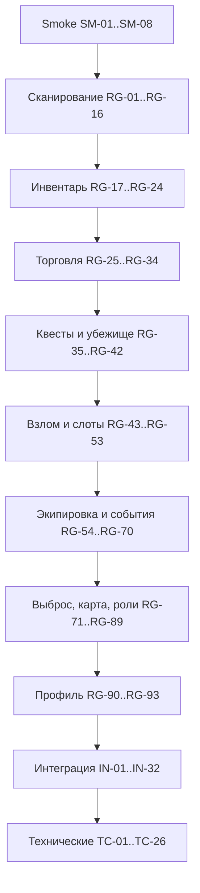

# План 2 — Тестовые сценарии Playwright для Wasteland PDA

> **Цель:** описать все бизнес- и технические сценарии тестирования, сопоставить каждый сценарий с областью покрытия, подходом к реализации и необходимыми изменениями.
>
> **Связанный документ:** [`plans/playwright-implementation-plan.md`](plans/playwright-implementation-plan.md) — План 1 (внедрение).

---

## 1. Обозначения

### 1.1. Типы сценариев

| Тип | Описание |
|---|---|
| **SMOKE** | Быстрая проверка работоспособности критического пути |
| **REG** | Регрессионный тест отдельной механики |
| **INT** | Интеграционный тест с двумя браузерными контекстами |
| **TECH** | Технический тест (localStorage, PWA, пасхалки) |

### 1.2. Подходы к реализации

| Подход | Описание |
|---|---|
| `scanDirect` | Прямой вызов `handleScan(code)` через `page.evaluate` |
| `scanViaManualInput` | Ввод кода через `#manual-code` + `submitManualCode()` |
| `seedPlayer` | Инъекция состояния в `localStorage` до загрузки |
| `readPlayer` | Чтение состояния из `localStorage` |
| `two-players` | Фикстура с двумя `BrowserContext` |
| `page.clock` | Управление временем для игровых циклов |
| `mockRandom` | Детерминированный `Math.random` |
| `dialog` | Перехват `alert`/`confirm` через `page.on('dialog')` |

### 1.3. Области покрытия (модули)

`main`, `navigation`, `scan`, `inventory`, `trade`, `p2p`, `dead`, `quests`, `shelter`, `hacking`, `slots`, `equipment`, `events`, `blowout`, `map`, `roles`, `admin`, `profile`, `radio`, `pwa`.

---

## 2. Smoke-тесты

| ID | Сценарий | Область покрытия | Подход | Необходимые изменения |
|---|---|---|---|---|
| SM-01 | Приложение загружается, `#bios-boot` исчезает, появляется `#screen` | `main`, `audio` | `game` fixture, ожидание `#screen` | Мок `AudioContext` |
| SM-02 | BIOS-boot проигрывается и завершается | `main`, `audio` | `page.clock` для ускорения | Мок аудио |
| SM-03 | Экран Базы (`view-base`) активен после загрузки | `main`, `navigation` | Проверка класса `active` | — |
| SM-04 | Ввод позывного и старт игры | `navigation` | `#base-callsign` → `startGameFromBase()` | — |
| SM-05 | HUD отображает HP, голод, радиацию, кредиты | `navigation` | Проверка `#hud` | — |
| SM-06 | Навигация по всем вьюхам через `switchView()` | `navigation` | Перебор вьюх, проверка `active` | — |
| SM-07 | Нижняя навигация (`#nav-buttons`) видна в Зоне | `navigation` | Проверка видимости | — |
| SM-08 | Возврат на Базу (`returnToBase()`) | `navigation`, `roles` | Клик + проверка вьюхи | — |

---

## 3. Регрессионные тесты (бизнес-сценарии)

### 3.1. Сканирование предметов

| ID | Сценарий | Область покрытия | Подход | Необходимые изменения |
|---|---|---|---|---|
| RG-01 | Сканирование предмета `item_*` добавляет его в инвентарь | `scan`, `inventory` | `scanDirect` | — |
| RG-02 | Сканирование еды `food_*` | `scan` | `scanDirect` | — |
| RG-03 | Сканирование медикаментов `med_*` | `scan` | `scanDirect` | — |
| RG-04 | Сканирование оружия `wpn_*` | `scan` | `scanDirect` | — |
| RG-05 | Сканирование хлама `junk_*` | `scan` | `scanDirect` | — |
| RG-06 | Сканирование снаряжения `gear_*` | `scan` | `scanDirect` | — |
| RG-07 | Кулдаун повторного сканирования (300 сек / 600 сек для gear) | `scan` | `page.clock` | — |
| RG-08 | Отказ при переполнении рюкзака (`MAX_BACKPACK_SIZE`) | `scan`, `inventory` | `seedPlayer` с полным инвентарём | — |
| RG-09 | Нераспознанный код → «ОШИБКА: Код не распознан» | `scan` | `scanDirect` | — |
| RG-10 | Ручной ввод кода через `#manual-code` | `scan` | `scanViaManualInput` | — |

### 3.2. Аномалии

| ID | Сценарий | Область покрытия | Подход | Необходимые изменения |
|---|---|---|---|---|
| RG-11 | Успешное взятие аномалии → артефакт | `scan` | `mockRandom` (roll ≤ 0.7) | — |
| RG-12 | Провал аномалии → −40 HP | `scan` | `mockRandom` (roll > 0.7) | — |
| RG-13 | Провал аномалии → потеря предмета | `scan` | `mockRandom` | — |
| RG-14 | Болт (`junk_6`) повышает шанс до 0.8 | `scan` | `seedPlayer` + `mockRandom` | — |
| RG-15 | Детектор `eq_anom` даёт 100% успех | `scan`, `equipment` | `seedPlayer` | — |
| RG-16 | Кулдаун аномалии 7200 сек | `scan` | `page.clock` | — |

### 3.3. Инвентарь, крафт, сейф

| ID | Сценарий | Область покрытия | Подход | Необходимые изменения |
|---|---|---|---|---|
| RG-17 | Использование еды (`useFood`) восстанавливает сытость | `inventory` | `seedPlayer` + клик | — |
| RG-18 | Использование медикаментов (`useMedkit`) восстанавливает HP | `inventory` | `seedPlayer` + клик | — |
| RG-19 | Быстрое использование (`quickUseItem`) | `inventory` | Клик | — |
| RG-20 | Выброс предмета (`dropItem`) | `inventory` | Клик | — |
| RG-21 | Перенос в сейф (`moveToSafe`) и обратно (`moveToInv`) | `inventory` | Клик | — |
| RG-22 | Крафт (`renderCraftBox`, `applyUpgrade`) | `inventory` | `seedPlayer` с хламом | — |
| RG-23 | Сохранение заметок (`saveSurvivalNotes`) | `inventory` | Ввод + проверка `wasteland_notes` | — |
| RG-24 | Антирад-эффект (`med_2`, `med_6`, `food_9`) снижает радиацию | `inventory` | `seedPlayer` | — |

### 3.4. Торговля с NPC

| ID | Сценарий | Область покрытия | Подход | Необходимые изменения |
|---|---|---|---|---|
| RG-25 | Открытие торговли по QR `npc_*` | `trade` | `scanDirect(QR.npc('npc_eng'))` | — |
| RG-26 | Покупка предмета (`buyItem`) | `trade` | Клик | — |
| RG-27 | Продажа предмета (`sellItem`) | `trade` | Клик | — |
| RG-28 | Продажа всего (`sellAllToBase`) | `trade` | Клик | — |
| RG-29 | Покупка экипировки (`buyEquipment`) | `trade`, `equipment` | Клик | — |
| RG-30 | Лечение у Доктора Кроу (`buyHeal`) | `trade` | Клик | — |
| RG-31 | Скидка `eq_trade` (−25%) | `trade`, `equipment` | `seedPlayer` | — |
| RG-32 | Доступ на Базу по карме (`npc_base` / `npc_bandit_base`) | `trade`, `roles` | `seedPlayer` с кармой | — |
| RG-33 | Обход доступа через `eq_pass_base` / `eq_pass_camp` | `trade`, `equipment` | `seedPlayer` | — |
| RG-34 | Репутация NPC влияет на цены/бонусы | `trade`, `npc` | `seedPlayer` с `npcRep` | — |

### 3.5. Квесты

| ID | Сценарий | Область покрытия | Подход | Необходимые изменения |
|---|---|---|---|---|
| RG-35 | Генерация контрактов (`generateQuestChoices`) | `quests` | Открытие вьюхи | `mockRandom` |
| RG-36 | Принятие контракта (`acceptQuest`) | `quests` | Клик | — |
| RG-37 | Особый контракт (`acceptSpecialQuest`) | `quests` | `seedPlayer` с репутацией | — |
| RG-38 | Отказ от контракта (`abandonQuest`) | `quests` | Клик + `dialog` | — |
| RG-39 | Завершение контракта и награда | `quests` | `seedPlayer` | — |

### 3.6. Убежище

| ID | Сценарий | Область покрытия | Подход | Необходимые изменения |
|---|---|---|---|---|
| RG-40 | Рендер убежища (`renderShelter`) | `shelter` | Открытие вьюхи | — |
| RG-41 | Улучшение убежища (`upgradeShelter`) | `shelter` | `seedPlayer` с кредитами | — |
| RG-42 | Бонусы уровней 1–5 (сытость, радиация, износ, HP, регенерация) | `shelter`, `events` | `seedPlayer` + `page.clock` | — |

### 3.7. Взлом

| ID | Сценарий | Область покрытия | Подход | Необходимые изменения |
|---|---|---|---|---|
| RG-43 | Запуск взлома по `safe_` / `usb_` / `term_` | `hacking` | `scanDirect` | — |
| RG-44 | Верный ключ → награда (кредиты + деталь) | `hacking` | `mockRandom` + выбор слова | — |
| RG-45 | Неверный ключ → снижение попыток | `hacking` | Клик | — |
| RG-46 | Исчерпание попыток → блокировка на 2 часа | `hacking` | 4 неверных клика | — |
| RG-47 | Прерывание взлома (`abortHacking`) | `hacking` | Клик + `dialog` | — |

### 3.8. Слоты

| ID | Сценарий | Область покрытия | Подход | Необходимые изменения |
|---|---|---|---|---|
| RG-48 | Изменение ставки (`adjustSlotBet`, `setSlotBetMax`) | `slots` | Клик | — |
| RG-49 | Вращение (`spinSlots`) списывает ставку | `slots` | `page.clock` | — |
| RG-50 | Джекпот 3× → выигрыш | `slots` | `mockRandom` | — |
| RG-51 | Проклятый джекпот 3× 💀 → +5 Рад | `slots` | `mockRandom` | — |
| RG-52 | Пара → выигрыш ×1.5 | `slots` | `mockRandom` | — |
| RG-53 | Недостаточно кредитов → отказ | `slots` | `seedPlayer` | — |

### 3.9. Экипировка и ремонт

| ID | Сценарий | Область покрытия | Подход | Необходимые изменения |
|---|---|---|---|---|
| RG-54 | Активация оружия (`toggleWeapon`) | `equipment` | Клик | — |
| RG-55 | Ремонт хламом (`repairWeaponWithJunk`) | `equipment` | `seedPlayer` | — |
| RG-56 | Ремонт на Базе (`repairWeaponAtBase`) | `equipment` | Клик | — |
| RG-57 | Снятие спецпредмета (`unequipSpecialItem`) | `equipment` | Клик | — |

### 3.10. События и циклы

| ID | Сценарий | Область покрытия | Подход | Необходимые изменения |
|---|---|---|---|---|
| RG-58 | Голод снижается каждые 60 сек | `events` | `page.clock` | — |
| RG-59 | Радиация накапливается при карме < 3 | `events` | `page.clock` + `seedPlayer` | — |
| RG-60 | Смерть от голода (−5 HP) | `events` | `page.clock` | — |
| RG-61 | Износ активного оружия | `events` | `page.clock` | — |
| RG-62 | Случайное событие (буря/споры/мутанты/пыль) | `events` | `mockRandom` + `page.clock` | — |
| RG-63 | Иммунитет `eq_storm` к бурям и спорам | `events`, `equipment` | `seedPlayer` | — |
| RG-64 | Жалование Рабочего (+3 💎/мин) | `events`, `roles` | `page.clock` + `seedPlayer` | — |
| RG-65 | Жалование Военного (+5 💎/мин) | `events`, `roles` | `page.clock` + `seedPlayer` | — |
| RG-66 | Регенерация убежища 5 ур. (+1 HP/мин) | `events`, `shelter` | `page.clock` + `seedPlayer` | — |

### 3.11. Инфекция и зомби

| ID | Сценарий | Область покрытия | Подход | Необходимые изменения |
|---|---|---|---|---|
| RG-67 | Инфекция → зомби через 5 мин | `events` | `page.clock` + `seedPlayer` | — |
| RG-68 | Зомби не может подбирать предметы | `scan`, `events` | `seedPlayer` с `zombieTime` | — |
| RG-69 | Вирус выгорает через 10 мин | `events` | `page.clock` | — |
| RG-70 | Зомби-режим: охота на живых (`zombie_id:`) | `scan`, `events` | `scanDirect` | — |

### 3.12. Пси-выброс

| ID | Сценарий | Область покрытия | Подход | Необходимые изменения |
|---|---|---|---|---|
| RG-71 | Запуск выброса (`triggerTestBlowout`) | `blowout` | Вызов функции | — |
| RG-72 | Укрытие по QR базы (`checkBlowoutShelterScan`) | `blowout`, `scan` | `scanDirect(QR.npc('npc_base'))` | — |
| RG-73 | Урон без укрытия (`resolveBlowout`) | `blowout` | `page.clock` | — |
| RG-74 | Баннер предупреждения (`#blowout-warning-banner`) | `blowout` | Проверка видимости | — |

### 3.13. Карта Зоны

| ID | Сценарий | Область покрытия | Подход | Необходимые изменения |
|---|---|---|---|---|
| RG-75 | Рендер карты (`renderZoneMap`) | `map` | Открытие вьюхи | — |
| RG-76 | Добавление метки (`addNewMapMarker`) | `map` | Клик + проверка `pda_zone_markers` | — |
| RG-77 | Удаление метки (`deleteSelectedMarker`) | `map` | Клик | — |
| RG-78 | Сохранение меток (`saveMapMarkers`) | `map` | Проверка `localStorage` | — |
| RG-79 | Загрузка кастомного фона (`handleMapBackgroundUpload`) | `map` | `setInputFiles` | — |
| RG-80 | Сброс фона (`resetCustomMapBg`) | `map` | Клик + `dialog` | — |

### 3.14. Роли, арест, фиксация бандитов

| ID | Сценарий | Область покрытия | Подход | Необходимые изменения |
|---|---|---|---|---|
| RG-81 | Арест по QR `arrest:` | `roles`, `scan` | `scanDirect` | — |
| RG-82 | Блокировка ПДА на 10 мин при аресте | `roles`, `events` | `page.clock` | — |
| RG-83 | Фиксация бандита (`bandit_id:`) → премия +100 💎 | `roles`, `scan` | `scanDirect` + `seedPlayer` | — |
| RG-84 | Ордер на арест (`generateArrestWarrantQR`) | `roles` | Вызов функции | — |
| RG-85 | Пасхалка «Хакер Пустошей» (5 кликов) | `roles`, `radio` | 5 кликов по заголовку | — |

### 3.15. Админ-режим

| ID | Сценарий | Область покрытия | Подход | Необходимые изменения |
|---|---|---|---|---|
| RG-86 | Вход админа (`adminLogin`, логин `админ`) | `admin` | Ввод + клик | — |
| RG-87 | Изменение кредитов (`adminModifyCredits`) | `admin` | Клик | — |
| RG-88 | Назначение роли (`adminSetRole`) | `admin`, `roles` | Клик | — |
| RG-89 | Сброс игры (`factoryReset`) | `admin` | Клик + `dialog` | — |

### 3.16. Профиль

| ID | Сценарий | Область покрытия | Подход | Необходимые изменения |
|---|---|---|---|---|
| RG-90 | Рендер профиля (`renderProfile`) | `profile` | Открытие вьюхи | — |
| RG-91 | Отображение кармы, репутации, арсенала | `profile` | `seedPlayer` | — |
| RG-92 | Смена позывного (`changeCallsign`) | `profile`, `utils` | Ввод + клик | — |
| RG-93 | Личный QR-код игрока (`player_id:`) | `profile`, `qr` | Проверка генерации | — |

---

## 4. Интеграционные тесты (два браузера)

Все сценарии используют фикстуру `two-players` (два `BrowserContext`).

### 4.1. P2P-торговля

| ID | Сценарий | Область покрытия | Подход | Необходимые изменения |
|---|---|---|---|---|
| IN-01 | Игрок A инициирует продажу (`initiateP2PTrade`) | `p2p`, `trade` | `pageA` + `pageB` | — |
| IN-02 | Игрок A показывает QR `p2ptrade:sell:...` | `p2p`, `qr` | Проверка генерации QR | — |
| IN-03 | Игрок B сканирует QR продажи | `p2p`, `scan` | `scanDirect` на `pageB` | — |
| IN-04 | Игрок B подтверждает сделку (`p2ptrade:confirm:...`) | `p2p` | `scanDirect` на `pageA` | — |
| IN-05 | Транзакция фиксируется в `processedTradeTxs` | `p2p` | `readPlayer` на обоих | — |
| IN-06 | Повторная транзакция отклоняется (защита от дублей) | `p2p` | Повторный `scanDirect` | — |
| IN-07 | Закрытие модального окна (`closeTradeModal`) | `p2p` | Клик | — |
| IN-08 | Обмен предметами между инвентарями | `p2p`, `inventory` | `readPlayer` | — |

### 4.2. Лечение умирающего

| ID | Сценарий | Область покрытия | Подход | Необходимые изменения |
|---|---|---|---|---|
| IN-09 | Игрок A умирает (`declareDeath`) | `dead` | `seedPlayer` hp=0 | — |
| IN-10 | Игрок A показывает QR `heal:...` (`showHealQR`) | `dead`, `qr` | Проверка QR | — |
| IN-11 | Игрок B сканирует `heal:` и отдаёт предмет | `scan`, `dead` | `scanDirect` на `pageB` | — |
| IN-12 | Игрок B получает QR `healitem:...` | `scan`, `qr` | Проверка QR | — |
| IN-13 | Игрок A сканирует `healitem:` и возрождается | `dead`, `scan` | `scanDirect` на `pageA` | — |
| IN-14 | Карма игрока B повышается (+1) | `scan` | `readPlayer` | — |
| IN-15 | `pendingHealId` сбрасывается после лечения | `dead` | `readPlayer` | — |
| IN-16 | Таймаут лечебного предмета (1 мин) | `dead`, `scan` | `page.clock` | — |

### 4.3. Ограбление трупа

| ID | Сценарий | Область покрытия | Подход | Необходимые изменения |
|---|---|---|---|---|
| IN-17 | Игрок A умирает, показывает QR `rob:...` | `dead`, `qr` | Проверка QR | — |
| IN-18 | Игрок B сканирует `rob:` и забирает предметы | `scan` | `scanDirect` на `pageB` | — |
| IN-19 | Карма игрока B снижается (−1) | `scan` | `readPlayer` | — |
| IN-20 | Повторное ограбление отклоняется | `scan` | Повторный `scanDirect` | — |
| IN-21 | Ограбление военного бандитом → +150 💎 | `scan`, `roles` | `seedPlayer` карма ≤ −3 | — |
| IN-22 | Ограбление военного выжившим → −1 карма | `scan` | `seedPlayer` | — |
| IN-23 | Жетоны добавляются в инвентарь | `scan`, `inventory` | `readPlayer` | — |

### 4.4. Арест и фиксация бандитов

| ID | Сценарий | Область покрытия | Подход | Необходимые изменения |
|---|---|---|---|---|
| IN-24 | Военный (A) генерирует ордер `arrest:` | `roles`, `qr` | Проверка QR | — |
| IN-25 | Бандит (B) сканирует ордер → арест | `roles`, `scan` | `scanDirect` на `pageB` | — |
| IN-26 | ПДА бандита блокируется на 10 мин | `roles`, `events` | `page.clock` | — |
| IN-27 | Военный сканирует `bandit_id:` → премия +100 💎 | `roles`, `scan` | `scanDirect` на `pageA` | — |
| IN-28 | Сканирование `player_id:` другого игрока | `scan`, `profile` | `scanDirect` | — |

### 4.5. Возрождение на базе

| ID | Сценарий | Область покрытия | Подход | Необходимые изменения |
|---|---|---|---|---|
| IN-29 | Умерший сканирует QR базы → возрождение | `dead`, `scan` | `scanDirect(QR.npc('npc_base'))` | — |
| IN-30 | Бандит не может возродиться на базе Выживших | `dead`, `roles` | `seedPlayer` карма | — |
| IN-31 | Обход через `eq_pass_base` | `dead`, `equipment` | `seedPlayer` | — |
| IN-32 | После возрождения HP/сытость/радиация сброшены | `dead` | `readPlayer` | — |

---

## 5. Технические сценарии

### 5.1. localStorage

| ID | Сценарий | Область покрытия | Подход | Необходимые изменения |
|---|---|---|---|---|
| TC-01 | Сохранение состояния в `wasteland_player` | `utils`, `player` | `readPlayer` | — |
| TC-02 | Загрузка состояния при старте | `player` | `seedPlayer` + reload | — |
| TC-03 | Миграция старых сохранений | `player` | `seedPlayer` со старой схемой | — |
| TC-04 | Обновление `pda_heartbeat` каждые 5 сек | `events` | `page.clock` + `readStorage` | — |
| TC-05 | Сохранение заметок в `wasteland_notes` | `inventory` | Ввод + `readStorage` | — |
| TC-06 | Сохранение меток в `pda_zone_markers` | `map` | Клик + `readStorage` | — |
| TC-07 | Сохранение фона в `pda_custom_map_bg` | `map` | `setInputFiles` + `readStorage` | — |
| TC-08 | Обработка повреждённого JSON | `player` | `seedPlayer` с невалидным JSON | — |
| TC-09 | Обработка офлайн-времени (`processOfflineTime`) | `utils`, `events` | `page.clock` | — |
| TC-10 | Сброс состояния (`factoryReset`) | `admin` | Клик + `readStorage` | — |

### 5.2. Функциональное тестирование отдельных возможностей

| ID | Сценарий | Область покрытия | Подход | Необходимые изменения |
|---|---|---|---|---|
| TC-11 | Генерация QR (`generateQR`) | `qr` | Проверка DOM | — |
| TC-12 | Fallback генерации QR (`useAPIFallback`) | `qr` | Мок ошибки | — |
| TC-13 | Радио-модуль (`toggleRadio`, `startRadio`) | `radio` | `page.clock` | Мок аудио |
| TC-14 | Пасхалка УВБ-76 (`triggerRadioEasterEgg`) | `radio` | `scanDirect('uvb76')` | — |
| TC-15 | Пасхалка «Хакер Пустошей» (5 кликов) | `radio`, `roles` | 5 кликов | — |
| TC-16 | Баннер событий (`showBanner`) | `utils` | Вызов + проверка DOM | — |
| TC-17 | Форматирование времени (`formatSurvivalTime`) | `utils` | Вызов функции | — |
| TC-18 | Расчёт кармы (`getKarmaStatus`) | `utils` | `seedPlayer` | — |
| TC-19 | Расчёт макс. HP (`getMaxHp`, `getEffectiveMaxHp`) | `utils` | `seedPlayer` | — |
| TC-20 | Множитель радиации (`getRadMultiplier`) | `utils` | `seedPlayer` | — |
| TC-21 | Уровни репутации NPC (`getNpcRepLevel`) | `npc` | Вызов функции | — |
| TC-22 | Процедурная генерация предметов (`ITEMS_DB`) | `items` | Проверка структуры | — |

### 5.3. PWA и офлайн

| ID | Сценарий | Область покрытия | Подход | Необходимые изменения |
|---|---|---|---|---|
| TC-23 | Регистрация Service Worker | `pwa`, `main` | Проверка `navigator.serviceWorker` | Отключить `serviceWorkers: 'block'` для этого теста |
| TC-24 | Манифест PWA доступен | `pwa` | `request.get('/manifest.json')` | — |
| TC-25 | Офлайн-загрузка из кэша | `pwa` | `context.setOffline(true)` | — |
| TC-26 | Fallback при отсутствии `Html5Qrcode` | `scan` | Не мокировать библиотеку | — |

---

## 6. Сводная матрица покрытия

| Область покрытия | Smoke | Regression | Integration | Technical | Всего |
|---|---|---|---|---|---|
| `main` | SM-01, SM-02 | — | — | TC-23 | 3 |
| `navigation` | SM-03…SM-08 | — | — | — | 6 |
| `scan` | — | RG-01…RG-16 | IN-11, IN-18, IN-25, IN-27, IN-29 | TC-26 | 22 |
| `inventory` | — | RG-17…RG-24 | IN-08, IN-23 | TC-05 | 10 |
| `trade` | — | RG-25…RG-34 | IN-01 | — | 11 |
| `p2p` | — | — | IN-01…IN-08 | — | 8 |
| `dead` | — | — | IN-09…IN-16, IN-29…IN-32 | — | 12 |
| `quests` | — | RG-35…RG-39 | — | — | 5 |
| `shelter` | — | RG-40…RG-42 | — | — | 3 |
| `hacking` | — | RG-43…RG-47 | — | — | 5 |
| `slots` | — | RG-48…RG-53 | — | — | 6 |
| `equipment` | — | RG-54…RG-57 | IN-31 | — | 5 |
| `events` | — | RG-58…RG-70 | IN-26 | TC-04, TC-09 | 15 |
| `blowout` | — | RG-71…RG-74 | — | — | 4 |
| `map` | — | RG-75…RG-80 | — | TC-06, TC-07 | 8 |
| `roles` | — | RG-81…RG-85 | IN-24…IN-28 | — | 10 |
| `admin` | — | RG-86…RG-89 | — | TC-10 | 5 |
| `profile` | — | RG-90…RG-93 | IN-28 | — | 5 |
| `radio` | — | RG-85 | — | TC-13…TC-15 | 4 |
| `pwa` | — | — | — | TC-23…TC-25 | 3 |
| `utils` | — | — | — | TC-01, TC-16…TC-20 | 6 |
| `qr` | — | — | IN-02, IN-12 | TC-11, TC-12 | 4 |
| `npc` | — | RG-34 | — | TC-21 | 2 |
| `items` | — | — | — | TC-22 | 1 |

**Итого сценариев:** 8 smoke + 93 регрессионных + 32 интеграционных + 26 технических = **159 сценариев**.

---

## 7. Порядок реализации сценариев

| Волна | Сценарии | Обоснование |
|---|---|---|
| 1 | SM-01…SM-08 | Базовая работоспособность |
| 2 | RG-01…RG-24 | Критический путь: сканирование и инвентарь |
| 3 | RG-25…RG-42 | Экономика и прогрессия |
| 4 | RG-43…RG-70 | Мини-игры и циклы выживания |
| 5 | RG-71…RG-93 | События, карта, роли, админ, профиль |
| 6 | IN-01…IN-32 | Интеграция двух браузеров |
| 7 | TC-01…TC-26 | Технические и PWA |

---

## 8. Необходимые изменения для реализации сценариев

| Изменение | Относящиеся сценарии | Описание |
|---|---|---|
| Мок `Html5Qrcode` | Все `scan`-сценарии | Подмена через `addInitScript` (см. План 1, раздел 4.1) |
| Мок `AudioContext` | SM-01, SM-02, TC-13 | Заглушка Web Audio API |
| Мок `Math.random` | RG-11…RG-16, RG-35, RG-48…RG-52, RG-62 | Детерминированный PRNG |
| `page.clock` | RG-07, RG-16, RG-42, RG-49, RG-58…RG-70, RG-82, IN-16, IN-26, TC-04, TC-09, TC-13 | Управление временем игровых циклов |
| Перехват диалогов | RG-38, RG-47, RG-80, RG-89 | `page.on('dialog')` |
| Фикстура `two-players` | IN-01…IN-32 | Два `BrowserContext` |
| `seedPlayer` | Множество RG/IN/TC | Инъекция состояния в `localStorage` |
| Отключение SW | Все, кроме TC-23…TC-25 | `serviceWorkers: 'block'` |
| `setInputFiles` | RG-79, TC-07 | Загрузка файла фона карты |
| `context.setOffline` | TC-25 | Проверка офлайн-режима |

---

## 9. Критерии полного покрытия

- [ ] Все 8 smoke-сценариев проходят во всех трёх браузерах.
- [ ] Все 93 регрессионных сценария покрывают каждую игровую механику.
- [ ] Все 32 интеграционных сценария проверяют взаимодействие двух браузеров.
- [ ] Все 26 технических сценариев покрывают `localStorage`, утилиты и PWA.
- [ ] Каждая область покрытия из раздела 6 имеет минимум один сценарий.
- [ ] Тесты детерминированы (моки времени и случайности).
- [ ] Тесты не изменяют код приложения.

---

## 10. Связь с Планом 1

Данный документ описывает **что тестировать**. Инфраструктура, установка, конфигурация, фикстуры и хелперы описаны в [`plans/playwright-implementation-plan.md`](plans/playwright-implementation-plan.md).

Соответствие:
- **Область покрытия** → раздел 6.1 Плана 1.
- **Подход к реализации** → раздел 4 Плана 1 (фикстуры и хелперы).
- **Необходимые изменения** → раздел 7 Плана 1.