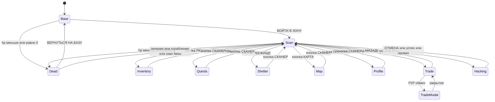
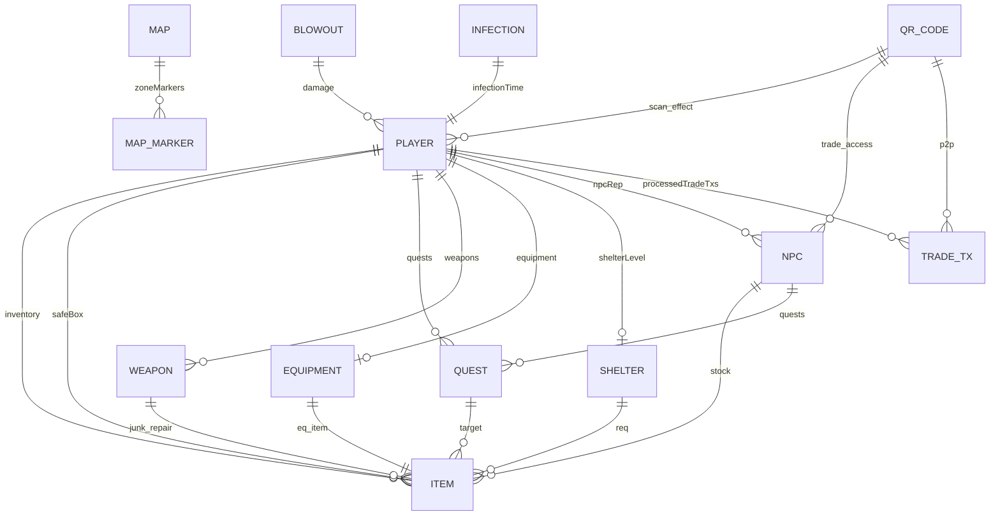

# Карта экранов и игровых сущностей — WASTELAND PDA (ГРИМ-СЕТЬ)

> Документ описывает архитектуру SPA-приложения: все экраны, переходы между ними с точными условиями срабатывания, а также модель игровых сущностей (свойства, связи, функции и внешние воздействия).
>
> Источник данных: [`src/js/main.js`](../src/js/main.js), [`src/js/views/navigation.js`](../src/js/views/navigation.js), [`src/js/state/player.js`](../src/js/state/player.js), [`src/js/config/constants.js`](../src/js/config/constants.js), [`src/js/logic/scan.js`](../src/js/logic/scan.js), [`src/js/logic/events.js`](../src/js/logic/events.js), [`src/js/logic/trade.js`](../src/js/logic/trade.js), [`src/js/logic/blowout.js`](../src/js/logic/blowout.js), [`src/js/logic/hacking.js`](../src/js/logic/hacking.js), [`src/js/logic/p2p.js`](../src/js/logic/p2p.js), [`src/js/logic/quests.js`](../src/js/logic/quests.js), [`src/js/logic/shelter.js`](../src/js/logic/shelter.js), [`src/js/logic/slots.js`](../src/js/logic/slots.js), [`src/js/logic/roles.js`](../src/js/logic/roles.js), [`src/js/logic/admin.js`](../src/js/logic/admin.js), [`src/js/logic/equipment.js`](../src/js/logic/equipment.js), [`src/js/logic/inventory.js`](../src/js/logic/inventory.js), [`src/js/logic/map.js`](../src/js/logic/map.js), [`src/js/views/dead.js`](../src/js/views/dead.js), [`src/js/views/profile.js`](../src/js/views/profile.js), [`src/js/views/scan.js`](../src/js/views/scan.js), [`src/js/views/base.js`](../src/js/views/base.js), [`src/js/core/utils.js`](../src/js/core/utils.js), [`src/js/core/audio.js`](../src/js/core/audio.js), [`src/js/core/qr.js`](../src/js/core/qr.js), [`src/js/config/items.js`](../src/js/config/items.js), [`src/js/config/npc.js`](../src/js/config/npc.js), [`src/js/config/upgrades.js`](../src/js/config/upgrades.js).

---

# РАЗДЕЛ 1. КАРТА ЭКРАНОВ

## 1.1. Архитектура навигации

Приложение — одностраничное (SPA). Все экраны (`.view`) существуют в DOM одновременно и переключаются функцией [`switchView(viewName)`](../src/js/views/navigation.js) через CSS-класс `active`. Дополнительно существуют оверлеи (модальные окна, баннеры, boot-экран), которые не являются вьюхами, но перекрывают контент.

Ключевые элементы каркаса (из [`src/index.template.html`](../src/index.template.html)):

| Элемент | ID / класс | Назначение |
|---|---|---|
| BIOS-boot overlay | `#boot-screen` | Анимация загрузки ПДА при входе в Зону |
| Корпус устройства | `.device-casing` | Визуальная рамка ПДА |
| Экран | `#screen` | Контейнер всех вьюх, к нему применяются CSS-фильтры |
| Баннер выброса | `#blowout-banner` | Глобальное предупреждение о пси-выбросе |
| HUD | `#hud` | Постоянная панель статуса (HP/РАД/ЕДА/ВЕС/💎) |
| Баннер событий | `#event-banner` | Всплывающие уведомления (5 сек) |
| Контент экранов | `#screen-content` | Содержит `VIEWS` + `NAV` |
| Навигация | `#nav` | Нижняя панель из 6 кнопок |
| Оверлеи | `#overlays` | Модальные окна (торговля и др.) |

## 1.2. Перечень экранов (VIEWS)

| # | Экран | DOM ID | Файл разметки | Файл логики | Назначение |
|---|---|---|---|---|---|
| 1 | **База (лобби/пауза)** | `view-base` | [`base.html`](../src/html/views/base.html) | [`base.js`](../src/js/views/base.js) | Стартовый экран, ввод позывного, вход в Зону |
| 2 | **Сканер** | `view-scan` | [`scan.html`](../src/html/views/scan.html) | [`scan.js`](../src/js/views/scan.js) + [`logic/scan.js`](../src/js/logic/scan.js) | Главный игровой экран: QR-сканер, радио, блокнот |
| 3 | **Инвентарь** | `view-inventory` | [`inventory.html`](../src/html/views/inventory.html) | [`logic/inventory.js`](../src/js/logic/inventory.js) | Рюкзак, сейф, крафт, апгрейды |
| 4 | **Квесты** | `view-quests` | [`quests.html`](../src/html/views/quests.html) | [`logic/quests.js`](../src/js/logic/quests.js) | Активные/доступные/выполненные задания |
| 5 | **Убежище** | `view-shelter` | [`shelter.html`](../src/html/views/shelter.html) | [`logic/shelter.js`](../src/js/logic/shelter.js) | Статистика, уровни убежища, бонусы |
| 6 | **Карта** | `view-map` | [`map.html`](../src/html/views/map.html) | [`logic/map.js`](../src/js/logic/map.js) | Интерактивная карта Зоны, редактор меток |
| 7 | **Профиль** | `view-profile` | [`profile.html`](../src/html/views/profile.html) | [`views/profile.js`](../src/js/views/profile.js) | Личное дело, репутация, арсенал, фото-модуль |
| 8 | **Торговля** | `view-trade` | [`trade.html`](../src/html/views/trade.html) | [`logic/trade.js`](../src/js/logic/trade.js) | Магазин NPC: покупка/продажа/лечение |
| 9 | **Взлом** | `view-hacking` | [`hacking.html`](../src/html/views/hacking.html) | [`logic/hacking.js`](../src/js/logic/hacking.js) | Мини-игра подбора пароля (Fallout-style) |
| 10 | **Смерть** | `view-dead` | [`dead.html`](../src/html/views/dead.html) | [`views/dead.js`](../src/js/views/dead.js) | Экран смерти, генерация QR трупа, лечение/ограбление |

## 1.3. Оверлеи, модалки и глобальные слои

| Элемент | ID | Тип | Условие появления | Условие скрытия |
|---|---|---|---|---|
| BIOS-boot | `#boot-screen` | Полноэкранный оверлей | Вызов [`runBootSequence()`](../src/js/core/audio.js) при входе в Зону | Автоскрытие через ~1800 мс |
| Баннер выброса | `#blowout-banner` | Глобальный баннер | `blowoutActive === true` (см. [`updateBlowoutUI()`](../src/js/logic/blowout.js)) | Окончание последовательности выброса |
| Баннер событий | `#event-banner` | Всплывающее уведомление | Любой вызов [`showBanner(text, color)`](../src/js/core/utils.js) | Автоскрытие через 5000 мс |
| HUD | `#hud` | Постоянная панель | Всегда, кроме экранов `base` и `dead` | — |
| Навигация | `#nav` | Нижняя панель | Всегда, кроме экранов `base` и `dead` | — |
| Модалка торговли | `#trade-modal` | Модальное окно | [`initiateP2PTrade()`](../src/js/logic/p2p.js) / [`startTradeConfirmScan()`](../src/js/logic/p2p.js) | [`closeTradeModal()`](../src/js/logic/p2p.js) |
| Модалка лечения | `#heal-qr-modal` | Модальное окно | [`showHealQR()`](../src/js/views/dead.js) | [`handleHealItemScan()`](../src/js/views/dead.js) / закрытие |
| Модалка ограбления | `#rob-qr-modal` | Модальное окно | [`showRobQR()`](../src/js/views/dead.js) | [`confirmRob()`](../src/js/views/dead.js) / закрытие |
| Модалка выжившего | `#survivor-qr-modal` | Модальное окно | [`showSurvivorQRModal()`](../src/js/views/dead.js) | Закрытие |
| Виньетка low-HP | класс `low-hp` на `#screen` | CSS-эффект | `player.hp <= 25%` от максимума (в [`updateHUD()`](../src/js/views/navigation.js)) | Восстановление HP |

## 1.4. Матрица переходов между экранами

Формат: **Откуда → Куда** | Триггер (событие) | Точное условие срабатывания | Функция-исполнитель.

### 1.4.1. Переходы через навигационную панель

| Откуда | Куда | Триггер | Условие | Функция |
|---|---|---|---|---|
| Любой экран (кроме base/dead) | scan | Клик по кнопке «СКАНЕР» | `player.hp > 0` | [`switchView('scan')`](../src/js/views/navigation.js) |
| Любой экран (кроме base/dead) | inventory | Клик по кнопке «РЮКЗАК» | `player.hp > 0` | [`switchView('inventory')`](../src/js/views/navigation.js) |
| Любой экран (кроме base/dead) | quests | Клик по кнопке «КВЕСТЫ» | `player.hp > 0` | [`switchView('quests')`](../src/js/views/navigation.js) |
| Любой экран (кроме base/dead) | shelter | Клик по кнопке «УБЕЖИЩЕ» | `player.hp > 0` | [`switchView('shelter')`](../src/js/views/navigation.js) |
| Любой экран (кроме base/dead) | map | Клик по кнопке «КАРТА» | `player.hp > 0` | [`switchView('map')`](../src/js/views/navigation.js) |
| Любой экран (кроме base/dead) | profile | Клик по кнопке «ПРОФИЛЬ» | Всегда (даже при `hp <= 0`) | [`switchView('profile')`](../src/js/views/navigation.js) |

> **Блокировка:** при `player.hp <= 0` разрешены только переходы на `base` и `profile`. Все прочие вызовы [`switchView()`](../src/js/views/navigation.js) игнорируются.

### 1.4.2. Переходы из экрана «База»

| Откуда | Куда | Триггер | Условие | Функция |
|---|---|---|---|---|
| base | scan | Клик по кнопке «ВОЙТИ В ЗОНУ» | Всегда | [`startGameFromBase()`](../src/js/views/base.js) → `runBootSequence()` → через 1800 мс `switchView('scan')` |
| base | scan | То же | `player.radioOn === true` | Дополнительно [`startRadio()`](../src/js/views/scan.js) |
| base | (без перехода) | Клик «СОХРАНИТЬ ПОЗЫВНОЙ» | `input.value.trim() !== ""` | [`saveBaseCallsign()`](../src/js/views/base.js) |
| base | dead | Автоматически при загрузке | `player.hp <= 0` при `init()` | [`checkDeathState()`](../src/js/views/dead.js) |

### 1.4.3. Переходы из экрана «Сканер» (по результату QR-скана)

Центральный обработчик — [`handleScan()`](../src/js/logic/scan.js). Ветвление по префиксу QR-кода:

| Префикс QR | Куда / Эффект | Точное условие | Функция |
|---|---|---|---|
| `item_`, `food_`, `med_`, `wpn_`, `junk_`, `gear_` | Остаётся на scan | Кулдаун предмета истёк; `inventory.length < maxSize` | [`handleScan()`](../src/js/logic/scan.js) |
| `loot` | Остаётся на scan | Всегда | [`handleScan()`](../src/js/logic/scan.js) |
| `heal:` | Остаётся на scan | `player.hp > 0` | [`handleScan()`](../src/js/logic/scan.js) |
| `healitem:` | Остаётся на scan | Всегда (обрабатывается до проверки `hp <= 0`) | [`handleHealItemScan()`](../src/js/views/dead.js) |
| `rob:` | Остаётся на scan | `player.hp > 0` | [`handleScan()`](../src/js/logic/scan.js) |
| `safe_` | Остаётся на scan | Всегда | [`handleScan()`](../src/js/logic/scan.js) |
| `usb_` | **hacking** | `player.hp > 0`; кулдаун взлома истёк | [`startHacking()`](../src/js/logic/hacking.js) |
| `term_` | **hacking** | `player.hp > 0`; кулдаун взлома истёк | [`startHacking()`](../src/js/logic/hacking.js) |
| `arrest:` | Остаётся на scan | `player.hp > 0` | [`handleArrestScan()`](../src/js/logic/roles.js) → блокировка на 10 мин |
| `bandit_id:` | Остаётся на scan | `player.role === "Военный"` | [`handleBanditScan()`](../src/js/logic/roles.js) → +100 💎 |
| `player_id:` | Остаётся на scan | Всегда | [`handleScan()`](../src/js/logic/scan.js) |
| `zombie_id:` | Остаётся на scan | `player.hp > 0` | [`handleScan()`](../src/js/logic/scan.js) |
| `anom_` | Остаётся на scan | `player.hp > 0` | [`handleScan()`](../src/js/logic/scan.js) |
| `p2ptrade:` | **trade-modal** (оверлей) | `player.hp > 0`; транзакция не обработана | [`handleP2PTradeScan()`](../src/js/logic/p2p.js) |
| NPC-код (`npc_*`) | **trade** | `player.hp > 0`; доступ к базе NPC разрешён | [`openTrade()`](../src/js/logic/trade.js) |
| Код укрытия при выбросе | Остаётся на scan | `blowoutActive === true`; код соответствует фракции | [`checkBlowoutShelterScan()`](../src/js/logic/blowout.js) → +200 💎 |

### 1.4.4. Переходы из экрана «Смерть»

Экран смерти — особый: навигационная панель скрывается (`#nav-buttons` → `display: none`), и экран предоставляет собственный набор кнопок. **Выход с экрана смерти возможен только через восстановление HP или возврат на базу** — кнопки перехода в профиль на экране смерти нет.

| Откуда | Куда | Триггер (кнопка) | Условие | Функция |
|---|---|---|---|---|
| dead | base | Клик «ВЕРНУТЬСЯ НА БАЗУ» | Всегда | [`returnToBase()`](../src/js/logic/roles.js) |
| dead | scan | Успешное лечение по QR предмета | [`handleHealItemScan()`](../src/js/views/dead.js) → `player.hp = min(maxHp, 20 + heal)`, `isCurrentlyDead = false` | [`handleHealItemScan()`](../src/js/views/dead.js) → [`checkDeathState()`](../src/js/views/dead.js) |
| dead | scan | Успешное ограбление | [`confirmRob()`](../src/js/views/dead.js) → очистка рюкзака | [`confirmRob()`](../src/js/views/dead.js) |
| dead | scan | Скан кода возрождения | Отсканирован `npc_base` / `npc_bandit_base` | [`startDeadScan()`](../src/js/logic/scan.js) → [`handleDeadScan()`](../src/js/logic/scan.js) |
| dead | scan | Ручной ввод кода | Введён `npc_base` / `npc_bandit_base` | [`submitDeadManualCode()`](../src/js/logic/scan.js) |
| Любой | dead | Автоматически | `player.hp <= 0` (проверка в циклах) | [`checkDeathState()`](../src/js/views/dead.js) |

> **Важная деталь:** при восстановлении HP (лечение или возрождение) функция [`checkDeathState()`](../src/js/views/dead.js) автоматически возвращает игрока на `scan` — `if (view-dead активен) switchView('scan')`. То есть выход из состояния смерти всегда ведёт на сканер.

> **Кнопки экрана смерти** (из [`dead.html`](../src/html/views/dead.html)):
> - «🟢 ЛЕЧЕНИЕ» → [`showHealQR()`](../src/js/views/dead.js) — генерация QR лечения (`heal:help_TS:callsign`), сохранение `pendingHealId`/`pendingHealAt`;
> - «🔴 ОГРАБИТЬ» → [`showRobQR()`](../src/js/views/dead.js) — генерация QR трупа (тип по роли/карме);
> - «☣️ ПОКАЗАТЬ QR ЗОМБИ (ОХОТА)» → [`showSurvivorQRModal()`](../src/js/views/dead.js);
> - «📷 ОТСКАНИРОВАТЬ ЛЕЧЕБНЫЙ ПРЕДМЕТ» → [`startHealItemScan()`](../src/js/views/dead.js) → [`handleHealItemScan()`](../src/js/views/dead.js) — сканирование QR `healitem:txId:itemId:heal:callsign` от спасителя;
> - «МАРОДЕР ЗАБРАЛ ЛУТ (ОЧИСТИТЬ)» → [`confirmRob()`](../src/js/views/dead.js);
>
> **Механика лечения (handshake):** спаситель сканирует `heal:`-код умирающего, отдаёт food/med, получает +1 кармы и показывает ответный QR `healitem:` с `txId`. Умирающий сканирует его; `txId` сверяется с `pendingHealId`, проверяется таймаут [`HEAL_ITEM_TIMEOUT_MS`](../src/js/config/constants.js) (1 минута) и одноразовость через `processedHealTxs`. Кнопка `confirmHeal()` удалена — лечение без реального QR невозможно.
> - «ВКЛЮЧИТЬ СКАНЕР БАЗЫ» → [`startDeadScan()`](../src/js/logic/scan.js);
> - поле ручного ввода кода → [`submitDeadManualCode()`](../src/js/logic/scan.js).

> **Примечание о профиле:** экран профиля технически доступен при `hp <= 0` (через [`switchView('profile')`](../src/js/views/navigation.js) он не блокируется), однако на экране смерти кнопки для этого перехода нет. Попасть в профиль мёртвым можно только если он был открыт до смерти. Из профиля при `hp <= 0` переходы на scan/inventory/quests/shelter/map заблокированы — доступны только profile и base.

### 1.4.5. Переходы из экрана «Торговля»

| Откуда | Куда | Триггер | Условие | Функция |
|---|---|---|---|---|
| trade | scan | Клик «НАЗАД» / закрытие | Всегда | [`switchView('scan')`](../src/js/views/navigation.js) |
| trade | trade | Покупка предмета | `player.score >= price`; `inventory.length < maxSize` | [`buyItem()`](../src/js/logic/trade.js) |
| trade | trade | Покупка экипировки | `player.score >= price`; слот экипировки свободен | [`buyEquipment()`](../src/js/logic/trade.js) |
| trade | trade | Продажа предмета | Предмет есть в рюкзаке | [`sellItem()`](../src/js/logic/trade.js) |
| trade | trade | Продать всё | В рюкзаке есть продаваемые предметы | [`sellAllToBase()`](../src/js/logic/trade.js) |
| trade | trade | Лечение | `player.score >= getHealCost()`; `player.hp < getMaxHp()` | [`buyHeal()`](../src/js/logic/trade.js) |
| trade | trade | Сдача квеста | Квест активен и выполнен | [`openTrade()`](../src/js/logic/trade.js) |

### 1.4.6. Переходы из экрана «Взлом»

| Откуда | Куда | Триггер | Условие | Функция |
|---|---|---|---|---|
| hacking | scan | Клик «ОТМЕНА» | Всегда | [`abortHacking()`](../src/js/logic/hacking.js) |
| hacking | scan | Успешный подбор пароля | Введено верное слово | [`submitHackWord()`](../src/js/logic/hacking.js) |
| hacking | scan | Исчерпаны попытки | `attempts === 0` (из 4) | [`updateHackAttemptsUI()`](../src/js/logic/hacking.js) |

### 1.4.7. Переходы внутри экранов (без смены вьюхи)

| Экран | Действие | Условие | Функция |
|---|---|---|---|
| inventory | Использовать аптечку | Есть `med_*` в рюкзаке | [`useMedkit()`](../src/js/logic/inventory.js) |
| inventory | Быстрое использование | Есть расходник | [`quickUseItem()`](../src/js/logic/inventory.js) |
| inventory | Съесть еду | Есть `food_*` | [`useFood()`](../src/js/logic/inventory.js) |
| inventory | Переместить в сейф | `safeBox.length < лимит` | [`moveToSafe()`](../src/js/logic/inventory.js) |
| inventory | Переместить в рюкзак | `inventory.length < maxSize` | [`moveToInv()`](../src/js/logic/inventory.js) |
| inventory | Применить апгрейд | Все `req` из [`SHELTER_UPGRADES`](../src/js/config/upgrades.js) в наличии | [`applyUpgrade()`](../src/js/logic/inventory.js) |
| quests | Взять квест | Активных < 2 | [`acceptQuest()`](../src/js/logic/quests.js) |
| quests | Взять особый квест | Выполнено ≥ 5 обычных; особых < 3 | [`acceptSpecialQuest()`](../src/js/logic/quests.js) |
| quests | Отказаться | Квест активен | [`abandonQuest()`](../src/js/logic/quests.js) |
| shelter | Улучшить убежище | Все `req` уровня в наличии; `shelterLevel < 5` | [`upgradeShelter()`](../src/js/logic/shelter.js) |
| profile | Включить/выключить оружие | Оружие в арсенале | [`toggleWeapon()`](../src/js/logic/equipment.js) |
| profile | Починить хламом | Есть `junk_*`; `durability < 100` | [`repairWeaponWithJunk()`](../src/js/logic/equipment.js) |
| profile | Ремонт на базе | Отсканирован QR базы; есть 💎 | [`repairWeaponAtBase()`](../src/js/logic/equipment.js) |
| profile | Снять экипировку | `player.equipment !== null` | [`unequipSpecialItem()`](../src/js/logic/equipment.js) |
| profile | Продать экипировку | `player.equipment !== null` | [`sellEquipment()`](../src/js/views/profile.js) |
| profile | Сделать фото ПДА | Выбран файл изображения | [`handlePdaPhotoCaptured()`](../src/js/views/profile.js) |
| map | Включить редактор меток | Всегда | [`toggleMapEditor()`](../src/js/logic/map.js) |
| map | Добавить метку | Всегда | [`addNewMapMarker()`](../src/js/logic/map.js) |
| map | Удалить метку | Метка выбрана | [`deleteSelectedMarker()`](../src/js/logic/map.js) |
| map | Загрузить фон карты | Выбран файл изображения | [`handleMapBackgroundUpload()`](../src/js/logic/map.js) |
| scan | Вкл/выкл радио | Всегда | [`toggleRadio()`](../src/js/views/scan.js) |
| scan | Пасхалка УВБ-76 | 5 кликов по радио | [`registerRadioSecretClick()`](../src/js/views/scan.js) |
| scan | Пасхалка ХАКЕР | 5 кликов по терминалу | [`registerHackClick()`](../src/js/views/scan.js) |

## 1.5. Граф экранов (Mermaid)

> Примечание: экран смерти не имеет кнопки перехода в профиль. Выход из состояния смерти — только через восстановление HP (лечение, скан кода возрождения) или возврат на базу. Если профиль был открыт до смерти, переходы из него в scan, inventory, quests, shelter, map заблокированы при `player.hp <= 0`.

## 1.6. Сводная таблица таймеров и периодических триггеров

| Таймер | Интервал | Условие запуска | Эффект | Функция |
|---|---|---|---|---|
| Инфекция | 1000 мс | `player.infectionTime` установлен | Прогресс инфекции → зомби | [`startInfectionLoop()`](../src/js/logic/events.js) |
| Heartbeat | 5000 мс | Всегда после `init()` | Арест, зарплата, регенерация, время выживания | [`startHeartbeatLoop()`](../src/js/logic/events.js) |
| События | 60000 мс | Всегда после `init()` | Износ оружия, голод, радиация, случайные события | [`startEventLoop()`](../src/js/logic/events.js) |
| Выброс | 3600000 мс (60 мин) | Всегда после `init()` | Пси-выброс: 240 с на укрытие | [`startBlowoutSchedule()`](../src/js/logic/blowout.js) |
| Радио | 20000–60000 мс | `player.radioOn === true` | Новое сообщение в эфире | [`startRadio()`](../src/js/views/scan.js) |
| Гейгер | Постоянно | Радиация > 0 | Звук счётчика Гейгера | [`runGeigerLoop()`](../src/js/core/audio.js) |
| Сердцебиение | Постоянно | Низкий HP | Звук сердцебиения | [`runHeartbeatLoop()`](../src/js/core/audio.js) |
| Офлайн-время | При загрузке | `pda_heartbeat` в localStorage | Износ, голод, радиация за офлайн | [`processOfflineTime()`](../src/js/core/utils.js) |

---

# РАЗДЕЛ 2. КАРТА ИГРОВЫХ СУЩНОСТЕЙ

## 2.1. Player (Игрок)

**Хранилище:** `localStorage['wasteland_player']` (ключ [`STORAGE_KEY_PLAYER`](../src/js/config/constants.js)).
**Определение:** [`src/js/state/player.js`](../src/js/state/player.js).

### Свойства

| Свойство | Тип | Назначение | Значения / диапазон |
|---|---|---|---|
| `callsign` | string | Позывной игрока | По умолчанию «СТАЛКЕР» |
| `hp` | number | Текущее здоровье | 0 … `getEffectiveMaxHp()` |
| `rads` | number | Накопленная радиация (съедает максимум HP) | 0 … `MAX_RADS` (60) |
| `hunger` | number | Сытость | 0 … `MAX_HUNGER` (100) |
| `score` | number | Кредиты (💎) | ≥ 0 |
| `tokens_collected` | number | Собрано токенов | ≥ 0 |
| `karma_score` | number | Карма | ≤ −3 БАНДИТ, ≥ +3 ГЕРОЙ |
| `role` | string | Роль игрока | Безработный / Рабочий / Военный / ХАКЕР ПУСТОШЕЙ |
| `inventory` | array | Рюкзак | ≤ `MAX_BACKPACK_SIZE` (30) |
| `safeBox` | array | Сейф (не теряется при смерти) | ≤ лимит сейфа |
| `quests` | array | Активные квесты | ≤ 2 активных |
| `completedQuests` | number | Счётчик выполненных | ≥ 0 |
| `equipment` | string \| null | ID надетой экипировки | `eq_*` или `null` |
| `weapons` | object | Арсенал: `{ name: { active, durability, cost } }` | durability 0…100 |
| `npcRep` | object | Репутация у NPC: `{ npc_id: points }` | 0 … ∞ (20 очков = 1 уровень) |
| `shelterLevel` | number | Уровень убежища | 0 … 5 |
| `stats` | object | Статистика (убийства, сканы и т.п.) | — |
| `infectionTime` | number \| null | Timestamp начала инфекции | — |
| `zombieTime` | number \| null | Timestamp превращения в зомби | — |
| `arrestedUntil` | number \| null | Timestamp окончания ареста | — |
| `inBase` | boolean | Флаг нахождения на базе | true/false |
| `radioOn` | boolean | Радио включено | true/false |
| `radioMessages` | array | Последние 3 сообщения радио | ≤ 3 |
| `isAdmin` | boolean | Флаг администратора | true/false |
| `isCurrentlyDead` | boolean | Флаг текущего состояния смерти (защита от повторного срабатывания) | true/false |
| `photoBonusReceived` | boolean | Получена ли награда за первое фото | true/false |
| `stats.deaths` | number | Счётчик смертей | ≥ 0 |
| `processedTradeTxs` | array | ID обработанных P2P-транзакций | — |
| `survivalTime` | number | Время выживания (сек) | ≥ 0 |

### Связи

- **Player → NPC:** через `npcRep` (репутация влияет на бонусы).
- **Player → Item:** через `inventory` и `safeBox`.
- **Player → Weapon:** через `weapons`.
- **Player → Equipment:** через `equipment`.
- **Player → Quest:** через `quests`.
- **Player → Shelter:** через `shelterLevel`.
- **Player → TradeTransaction:** через `processedTradeTxs`.

### Функции, изменяющие состояние

| Функция | Файл | Что меняет |
|---|---|---|
| [`saveState()`](../src/js/core/utils.js) | utils.js | Сериализация в localStorage + обновление UI |
| [`processOfflineTime()`](../src/js/core/utils.js) | utils.js | HP, hunger, rads, durability за офлайн |
| [`getMaxHp()`](../src/js/core/utils.js) | utils.js | Расчёт максимума HP (репутация + убежище) |
| [`getEffectiveMaxHp()`](../src/js/core/utils.js) | utils.js | Максимум HP минус радиация |
| [`getRadMultiplier()`](../src/js/core/utils.js) | utils.js | Множитель радиации (маска/плащ) |
| [`getKarmaStatus()`](../src/js/core/utils.js) | utils.js | Статус кармы |
| [`startInfectionLoop()`](../src/js/logic/events.js) | events.js | infectionTime, zombieTime, hp |
| [`startHeartbeatLoop()`](../src/js/logic/events.js) | events.js | arrestedUntil, score, hp, survivalTime |
| [`startEventLoop()`](../src/js/logic/events.js) | events.js | hunger, rads, durability, hp |
| [`handleScan()`](../src/js/logic/scan.js) | scan.js | inventory, score, hp, rads, karma_score, npcRep |
| [`useMedkit()`](../src/js/logic/inventory.js) | inventory.js | hp, infectionTime |
| [`useFood()`](../src/js/logic/inventory.js) | inventory.js | hunger |
| [`buyItem()`](../src/js/logic/trade.js) | trade.js | score, inventory |
| [`buyHeal()`](../src/js/logic/trade.js) | trade.js | score, hp |
| [`resolveBlowout()`](../src/js/logic/blowout.js) | blowout.js | hp, rads |
| [`handleHealItemScan()`](../src/js/views/dead.js) | dead.js | hp, rads, pendingHealId, processedHealTxs |
| [`confirmRob()`](../src/js/views/dead.js) | dead.js | inventory |
| [`adminModifyCredits()`](../src/js/logic/roles.js) | roles.js | score |
| [`adminSetRole()`](../src/js/logic/roles.js) | roles.js | role |

## 2.2. NPC (Неигровой персонаж)

**Определение:** [`src/js/config/npc.js`](../src/js/config/npc.js) — `NPC_DB`.

### Свойства

| Свойство | Тип | Назначение |
|---|---|---|
| `id` | string | Идентификатор (`npc_eng`, `npc_med`, `npc_trad`, `npc_bar`, `npc_base`, `npc_bandit_base`) |
| `name` | string | Имя NPC |
| `icon` | string | Эмодзи-иконка |
| `desc` | string | Описание / специализация |
| `stock` | array | Ассортимент товаров (генерируется динамически) |
| `repLevel` | number | Уровень репутации игрока у NPC (0–10) |

### Связи

- **NPC → Player:** через `player.npcRep[npc.id]`.
- **NPC → Item:** через `stock` (ассортимент).
- **NPC → Quest:** через сдачу квестов в [`openTrade()`](../src/js/logic/trade.js).

### Функции и воздействия

| Функция | Файл | Эффект |
|---|---|---|
| [`getNpcRepLevel()`](../src/js/config/npc.js) | npc.js | Расчёт уровня репутации (points / 20) |
| [`openTrade()`](../src/js/logic/trade.js) | trade.js | Генерация стока, проверка доступа, сдача квестов |
| [`handleScan()`](../src/js/logic/scan.js) | scan.js | Начисление очков репутации при скане NPC-кода |
| [`acceptQuest()`](../src/js/logic/quests.js) | quests.js | +25 очков репутации при сдаче квеста |

### Внешние воздействия

- Сканирование QR-кода NPC → открытие торговли.
- Сдача квеста → рост репутации.
- Репутация у `npc_med` → рост максимума HP.
- Репутация у `npc_eng` → рост размера рюкзака.
- Репутация у `npc_trad` → защита оружия от износа.
- Репутация у `npc_bar` → рост максимума сытости.

## 2.3. Item (Предмет)

**Определение:** [`src/js/config/items.js`](../src/js/config/items.js) — процедурный `ITEMS_DB` + функция `genQ()`.

### Свойства

| Свойство | Тип | Назначение |
|---|---|---|
| `id` | string | Идентификатор (`food_1`, `med_2`, `wpn_3`, `junk_5`, `gear_8`, `eq_rad`, …) |
| `name` | string | Название предмета |
| `type` | string | Категория: food / med / wpn / junk / gear / token / artifact |
| `val` | number | Базовая стоимость (💎) |
| `desc` | string | Описание |
| `effect` | object | Эффект применения (hp, hunger, rads и т.п.) |
| `req` | object | Требования для крафта/апгрейда |

### Категории предметов

| Префикс | Категория | Применение |
|---|---|---|
| `food_` | Еда | Восстановление сытости |
| `med_` | Медикаменты | Восстановление HP, снятие инфекции |
| `wpn_` | Оружие | Экипировка в арсенал |
| `junk_` | Хлам | Крафт, ремонт оружия |
| `gear_` | Снаряжение | Крафт, апгрейды убежища |
| `eq_` | Спецэкипировка | Защита от радиации, голода, выброса и т.п. |
| `token` | Токен | Коллекционный предмет |

### Связи

- **Item → Player:** через `inventory` и `safeBox`.
- **Item → Shelter:** через `req` в [`SHELTER_UPGRADES`](../src/js/config/upgrades.js).
- **Item → Weapon:** через ремонт (`junk_*`).
- **Item → NPC:** через `stock` (ассортимент).

### Функции и воздействия

| Функция | Файл | Эффект |
|---|---|---|
| [`genQ()`](../src/js/config/items.js) | items.js | Генерация QR-кода предмета |
| [`handleScan()`](../src/js/logic/scan.js) | scan.js | Добавление предмета в рюкзак |
| [`useFood()`](../src/js/logic/inventory.js) | inventory.js | Применение еды |
| [`useMedkit()`](../src/js/logic/inventory.js) | inventory.js | Применение медикаментов |
| [`dropItem()`](../src/js/logic/inventory.js) | inventory.js | Выброс предмета |
| [`moveToSafe()`](../src/js/logic/inventory.js) / [`moveToInv()`](../src/js/logic/inventory.js) | inventory.js | Перемещение между рюкзаком и сейфом |
| [`sellItem()`](../src/js/logic/trade.js) | trade.js | Продажа предмета |
| [`buyItem()`](../src/js/logic/trade.js) | trade.js | Покупка предмета |

## 2.4. Quest (Квест)

**Определение:** [`src/js/logic/quests.js`](../src/js/logic/quests.js).

### Свойства

| Свойство | Тип | Назначение |
|---|---|---|
| `id` | string | Идентификатор квеста |
| `type` | string | Тип: обычный / особый |
| `title` | string | Название |
| `desc` | string | Описание задачи |
| `target` | string | Целевой предмет/действие |
| `count` | number | Требуемое количество |
| `progress` | number | Текущий прогресс |
| `reward` | number | Награда (💎) |
| `repReward` | number | Награда репутации (+25) |
| `npc` | string | NPC-заказчик |
| `status` | string | active / completed / abandoned |

### Связи

- **Quest → Player:** через `player.quests`.
- **Quest → NPC:** через `npc` (заказчик).
- **Quest → Item:** через `target` (целевой предмет).

### Функции и воздействия

| Функция | Файл | Эффект |
|---|---|---|
| [`generateQuestChoices()`](../src/js/logic/quests.js) | quests.js | Генерация доступных квестов |
| [`createRandomQuest()`](../src/js/logic/quests.js) | quests.js | Создание случайного квеста |
| [`renderQuests()`](../src/js/logic/quests.js) | quests.js | Отрисовка списка квестов |
| [`acceptQuest()`](../src/js/logic/quests.js) | quests.js | Принятие квеста (макс 2 активных) |
| [`acceptSpecialQuest()`](../src/js/logic/quests.js) | quests.js | Принятие особого квеста (макс 3) |
| [`abandonQuest()`](../src/js/logic/quests.js) | quests.js | Отказ от квеста |
| [`openTrade()`](../src/js/logic/trade.js) | trade.js | Сдача выполненного квеста |

### Ограничения

- Максимум 2 активных квеста одновременно.
- Максимум 5 обычных квестов в списке.
- Особые квесты доступны после 5 выполненных обычных (макс 3).

## 2.5. Weapon (Оружие)

**Определение:** объект `player.weapons` в [`src/js/state/player.js`](../src/js/state/player.js), рендер в [`views/profile.js`](../src/js/views/profile.js).

### Свойства

| Свойство | Тип | Назначение |
|---|---|---|
| `name` | string | Название (ключ объекта) |
| `active` | boolean | Экипировано ли оружие |
| `durability` | number | Прочность 0…100 |
| `cost` | number | Стоимость ремонта |

### Базовый арсенал

| Оружие | Стоимость | Особенность |
|---|---|---|
| Противогаз ГП-5 | 250 | Защита от радиации (−60%) |
| Нож | 20 | — |
| Пистолет | 50 | — |
| Дробовик | 80 | — |
| Пистолет-пулемет | 100 | — |
| Автомат | 150 | — |
| Пулемет | 250 | — |
| Винтовка | 200 | — |

### Связи

- **Weapon → Player:** через `player.weapons`.
- **Weapon → Item:** через `junk_*` (ремонт хламом).
- **Weapon → NPC:** через ремонт на базе.

### Функции и воздействия

| Функция | Файл | Эффект |
|---|---|---|
| [`toggleWeapon()`](../src/js/logic/equipment.js) | equipment.js | Вкл/выкл оружие |
| [`repairWeaponWithJunk()`](../src/js/logic/equipment.js) | equipment.js | Ремонт хламом |
| [`getRepairCost()`](../src/js/logic/equipment.js) | equipment.js | Расчёт стоимости ремонта |
| [`repairWeaponAtBase()`](../src/js/logic/equipment.js) | equipment.js | Ремонт на базе (через QR) |
| [`startEventLoop()`](../src/js/logic/events.js) | events.js | Износ оружия со временем |
| [`processOfflineTime()`](../src/js/core/utils.js) | utils.js | Износ за офлайн-время |
| [`getRadMultiplier()`](../src/js/core/utils.js) | utils.js | Противогаз даёт −60% радиации |

## 2.6. Equipment (Спецэкипировка)

**Определение:** `player.equipment` (ID предмета `eq_*` из [`ITEMS_DB`](../src/js/config/items.js)).

### Свойства

| Свойство | Тип | Назначение |
|---|---|---|
| `id` | string | `eq_rad`, `eq_gas`, `eq_hunger`, `eq_storm`, `eq_anom`, `eq_trade`, `eq_pass_base`, `eq_pass_camp` |
| `name` | string | Название |
| `val` | number | Стоимость (продажа за 50%) |
| `desc` | string | Описание эффекта |

### Эффекты экипировки

| ID | Эффект |
|---|---|
| `eq_rad` | −50% радиации |
| `eq_gas` | Защита от газов |
| `eq_hunger` | −66% расхода сытости |
| `eq_storm` | Защита от пылевой бури |
| `eq_anom` | Защита от аномалий |
| `eq_trade` | Бонус к торговле |
| `eq_pass_base` | Пропуск на базу |
| `eq_pass_camp` | Пропуск в лагерь |

### Связи

- **Equipment → Player:** через `player.equipment` (один слот).
- **Equipment → Item:** это предмет из `ITEMS_DB`.
- **Equipment → NPC:** покупка у торговца.

### Функции и воздействия

| Функция | Файл | Эффект |
|---|---|---|
| [`buyEquipment()`](../src/js/logic/trade.js) | trade.js | Покупка экипировки |
| [`unequipSpecialItem()`](../src/js/logic/equipment.js) | equipment.js | Снятие экипировки |
| [`sellEquipment()`](../src/js/views/profile.js) | profile.js | Продажа за 50% стоимости |
| [`getRadMultiplier()`](../src/js/core/utils.js) | utils.js | Учёт `eq_rad` |
| [`processOfflineTime()`](../src/js/core/utils.js) | utils.js | Учёт `eq_hunger` |

## 2.7. Shelter (Убежище)

**Определение:** [`src/js/config/upgrades.js`](../src/js/config/upgrades.js) — `SHELTER_UPGRADES`, логика в [`src/js/logic/shelter.js`](../src/js/logic/shelter.js).

### Свойства

| Свойство | Тип | Назначение |
|---|---|---|
| `level` | number | Уровень убежища (0–5) |
| `name` | string | Название уровня |
| `req` | object | Требуемые предметы `{ item_id: count }` |
| `bonus` | string | Текстовое описание бонуса |

### Уровни

| Уровень | Название | Требования | Бонус |
|---|---|---|---|
| 1 | Палатка | junk_3×2, junk_5×1, gear_5×1 | Сытость −10% расхода |
| 2 | Землянка | junk_3×3, junk_2×2, gear_3×1, gear_17×1 | Радиация −10% накопления |
| 3 | Деревянный бункер | junk_3×5, junk_4×3, junk_8×2, gear_8×1 | Износ оружия −10% |
| 4 | Бетонный бункер | junk_3×8, junk_11×4, junk_12×3, gear_2×1 | Макс. HP +10% |
| 5 | Укрепленный форпост | junk_3×12, junk_11×5, junk_12×5, eq_anom×1 | Регенерация +1 HP/мин, вес +3 кг |

### Связи

- **Shelter → Player:** через `player.shelterLevel`.
- **Shelter → Item:** через `req` (требуемые предметы).
- **Shelter → HP:** уровень 4 даёт +10% макс. HP ([`getMaxHp()`](../src/js/core/utils.js)).
- **Shelter → Backpack:** уровень 5 даёт +3 кг.

### Функции и воздействия

| Функция | Файл | Эффект |
|---|---|---|
| [`renderShelter()`](../src/js/logic/shelter.js) | shelter.js | Отрисовка статистики и требований |
| [`upgradeShelter()`](../src/js/logic/shelter.js) | shelter.js | Повышение уровня |
| [`applyUpgrade()`](../src/js/logic/inventory.js) | inventory.js | Применение апгрейда из инвентаря |
| [`startHeartbeatLoop()`](../src/js/logic/events.js) | events.js | Регенерация +1 HP/мин (уровень 5) |
| [`getMaxHp()`](../src/js/core/utils.js) | utils.js | Учёт бонуса уровня 4 |

## 2.8. MapMarker (Метка карты)

**Определение:** [`src/js/logic/map.js`](../src/js/logic/map.js), хранилище `localStorage['pda_zone_markers']`.

### Свойства

| Свойство | Тип | Назначение |
|---|---|---|
| `id` | string | Идентификатор (`m_<timestamp>`) |
| `name` | string | Название локации |
| `icon` | string | Эмодзи-иконка |
| `x` | number | Координата X в % (2–98) |
| `y` | number | Координата Y в % (2–98) |
| `desc` | string | Описание локации |
| `color` | string | Цвет метки |

### Связи

- **MapMarker → Map:** через `zoneMarkers` (массив).
- **MapMarker → localStorage:** через `STORAGE_KEY_MAP_MARKERS`.
- **Map → Background:** через `STORAGE_KEY_MAP_BG`.

### Функции и воздействия

| Функция | Файл | Эффект |
|---|---|---|
| [`initMapSystem()`](../src/js/logic/map.js) | map.js | Загрузка меток из localStorage |
| [`renderZoneMap()`](../src/js/logic/map.js) | map.js | Отрисовка меток |
| [`selectMapMarker()`](../src/js/logic/map.js) | map.js | Выбор метки |
| [`toggleMapEditor()`](../src/js/logic/map.js) | map.js | Вкл/выкл редактор |
| [`saveSelectedMarker()`](../src/js/logic/map.js) | map.js | Сохранение изменений |
| [`addNewMapMarker()`](../src/js/logic/map.js) | map.js | Добавление метки |
| [`deleteSelectedMarker()`](../src/js/logic/map.js) | map.js | Удаление метки |
| [`resetMapMarkersToDefault()`](../src/js/logic/map.js) | map.js | Сброс к стандарту |
| [`saveMapMarkers()`](../src/js/logic/map.js) | map.js | Сохранение в localStorage |
| [`startDragMarker()`](../src/js/logic/map.js) | map.js | Перетаскивание (мышь) |
| [`startDragMarkerTouch()`](../src/js/logic/map.js) | map.js | Перетаскивание (тач) |
| [`handleMapBackgroundUpload()`](../src/js/logic/map.js) | map.js | Загрузка фона (сжатие до 640px) |
| [`uploadCustomMapBg()`](../src/js/logic/map.js) | map.js | Загрузка фона без сжатия |
| [`resetCustomMapBg()`](../src/js/logic/map.js) | map.js | Сброс фона |

## 2.9. TradeTransaction (P2P-транзакция)

**Определение:** [`src/js/logic/p2p.js`](../src/js/logic/p2p.js).

### Свойства

| Свойство | Тип | Назначение |
|---|---|---|
| `txId` | string | Уникальный ID транзакции |
| `type` | string | sell / confirm |
| `item` | object | Предмет обмена |
| `price` | number | Цена |
| `from` | string | Позывной продавца |
| `to` | string | Позывной покупателя |
| `status` | string | pending / confirmed / processed |

### Связи

- **TradeTransaction → Player:** через `processedTradeTxs` (защита от повторов).
- **TradeTransaction → Item:** через `item`.
- **TradeTransaction → NPC:** через `currentTradeNpc` (глобал).

### Функции и воздействия

| Функция | Файл | Эффект |
|---|---|---|
| [`initiateP2PTrade()`](../src/js/logic/p2p.js) | p2p.js | Инициация обмена |
| [`startTradeConfirmScan()`](../src/js/logic/p2p.js) | p2p.js | Подтверждение через скан |
| [`handleP2PTradeScan()`](../src/js/logic/p2p.js) | p2p.js | Обработка QR (sell/confirm) |
| [`closeTradeModal()`](../src/js/logic/p2p.js) | p2p.js | Закрытие модалки |

### Защита

- Повторная обработка транзакции блокируется через `player.processedTradeTxs`.

## 2.10. Blowout (Пси-выброс)

**Определение:** [`src/js/logic/blowout.js`](../src/js/logic/blowout.js).

### Свойства

| Свойство | Тип | Назначение |
|---|---|---|
| `blowoutActive` | boolean | Активен ли выброс |
| `blowoutTimer` | number | Таймер до выброса |
| `blowoutCountdown` | number | Обратный отсчёт (240 с) |
| `shelterCodes` | object | Коды укрытий по фракциям |

### Связи

- **Blowout → Player:** через `hp`, `rads` (урон при отсутствии укрытия).
- **Blowout → QR:** через коды укрытий.
- **Blowout → Banner:** через `#blowout-banner`.

### Функции и воздействия

| Функция | Файл | Эффект |
|---|---|---|
| [`startBlowoutSchedule()`](../src/js/logic/blowout.js) | blowout.js | Планирование выброса (60 мин) |
| [`triggerTestBlowout()`](../src/js/logic/blowout.js) | blowout.js | Тестовый выброс |
| [`triggerBlowoutSequence()`](../src/js/logic/blowout.js) | blowout.js | Последовательность (240 с) |
| [`updateBlowoutUI()`](../src/js/logic/blowout.js) | blowout.js | Обновление баннера |
| [`resolveBlowout()`](../src/js/logic/blowout.js) | blowout.js | HP до 30%, +35 рад |
| [`checkBlowoutShelterScan()`](../src/js/logic/blowout.js) | blowout.js | Проверка кода укрытия (+200 💎) |

### Условия

- Выброс каждые 60 минут.
- На укрытие даётся 240 секунд.
- При отсутствии укрытия: HP снижается до 30%, радиация +35.
- Скан правильного кода укрытия: +200 💎.

## 2.11. Infection / Zombie (Инфекция и зомби)

**Определение:** [`src/js/logic/events.js`](../src/js/logic/events.js) — `startInfectionLoop()`.

### Свойства

| Свойство | Тип | Назначение |
|---|---|---|
| `infectionTime` | number \| null | Timestamp начала инфекции |
| `zombieTime` | number \| null | Timestamp превращения в зомби |
| `INFECTION_TIME_MS` | const | 5 минут (300000 мс) |
| `ZOMBIE_TIME_MS` | const | 10 минут (600000 мс) |

### Связи

- **Infection → Player:** через `infectionTime`, `zombieTime`.
- **Infection → Item:** лечение через `med_*` ([`useMedkit()`](../src/js/logic/inventory.js)).
- **Infection → Death:** 15% шанс инфекции при смерти ([`checkDeathState()`](../src/js/views/dead.js)).

### Функции и воздействия

| Функция | Файл | Эффект |
|---|---|---|
| [`startInfectionLoop()`](../src/js/logic/events.js) | events.js | Прогресс инфекции → зомби → выгорание |
| [`useMedkit()`](../src/js/logic/inventory.js) | inventory.js | Лечение инфекции |
| [`checkDeathState()`](../src/js/views/dead.js) | dead.js | 15% шанс инфекции при смерти |
| [`renderProfile()`](../src/js/views/profile.js) | profile.js | Отображение статуса ИНФИЦИРОВАН / ЗОМБИ |

### Тайминги

- Инфекция: 5 минут до превращения в зомби.
- Зомби: 10 минут до выгорания (смерти).

## 2.12. Role (Роль)

**Определение:** `player.role`, логика в [`src/js/logic/roles.js`](../src/js/logic/roles.js).

### Свойства

| Свойство | Тип | Назначение |
|---|---|---|
| `role` | string | Текущая роль |

### Роли

| Роль | Условие получения | Особенность |
|---|---|---|
| Безработный | По умолчанию | — |
| Рабочий | Через админ-панель | — |
| Военный | Через админ-панель | +100 💎 за скан `bandit_id:` |
| ХАКЕР ПУСТОШЕЙ | 5 кликов по терминалу (пасхалка) | Доступ к взлому |

### Связи

- **Role → Player:** через `player.role`.
- **Role → QR:** тип трупа при смерти ([`showRobQR()`](../src/js/views/dead.js)).
- **Role → Trade:** доступ к базам фракций.

### Функции и воздействия

| Функция | Файл | Эффект |
|---|---|---|
| [`adminSetRole()`](../src/js/logic/roles.js) | roles.js | Установка роли (админ) |
| [`registerHackClick()`](../src/js/views/scan.js) | scan.js | Получение роли ХАКЕР ПУСТОШЕЙ |
| [`handleBanditScan()`](../src/js/logic/roles.js) | roles.js | +100 💎 военному |
| [`showRobQR()`](../src/js/views/dead.js) | dead.js | Тип трупа по роли |

## 2.13. Karma (Карма)

**Определение:** `player.karma_score`, [`getKarmaStatus()`](../src/js/core/utils.js).

### Свойства

| Свойство | Тип | Назначение |
|---|---|---|
| `karma_score` | number | Очки кармы |

### Статусы

| Диапазон | Статус | CSS-класс |
|---|---|---|
| ≥ +3 | ГЕРОЙ | `hero-glow` |
| −2 … +2 | ВЫЖИВШИЙ | — |
| ≤ −3 | БАНДИТ | `danger` |

### Связи

- **Karma → Player:** через `karma_score`.
- **Karma → Radiation:** при `karma_score < 3` радиация накапливается в офлайне.
- **Karma → Death:** тип трупа ([`showRobQR()`](../src/js/views/dead.js)).

### Функции и воздействия

| Функция | Файл | Эффект |
|---|---|---|
| [`getKarmaStatus()`](../src/js/core/utils.js) | utils.js | Определение статуса |
| [`handleScan()`](../src/js/logic/scan.js) | scan.js | Изменение кармы при действиях |
| [`processOfflineTime()`](../src/js/core/utils.js) | utils.js | Радиация при карме < 3 |
| [`renderProfile()`](../src/js/views/profile.js) | profile.js | Отображение статуса |

## 2.14. Reputation (Репутация)

**Определение:** `player.npcRep`, [`getNpcRepLevel()`](../src/js/config/npc.js).

### Свойства

| Свойство | Тип | Назначение |
|---|---|---|
| `npcRep` | object | `{ npc_id: points }` |
| `points` | number | Очки репутации |
| `level` | number | Уровень = `floor(points / 20)` |

### Связи

- **Reputation → NPC:** через `npcRep[npc.id]`.
- **Reputation → Player:** бонусы к HP, рюкзаку, сытости, износу.

### Функции и воздействия

| Функция | Файл | Эффект |
|---|---|---|
| [`getNpcRepLevel()`](../src/js/config/npc.js) | npc.js | Расчёт уровня |
| [`handleScan()`](../src/js/logic/scan.js) | scan.js | Начисление очков |
| [`acceptQuest()`](../src/js/logic/quests.js) | quests.js | +25 очков за квест |
| [`getMaxHp()`](../src/js/core/utils.js) | utils.js | Бонус HP от `npc_med` |

### Начисление

- +20 очков = 1 уровень репутации.
- +25 очков за сдачу квеста.
- Максимальный уровень: 10.

## 2.15. QR-код (Игровой механизм)

**Определение:** генерация — [`src/js/core/qr.js`](../src/js/core/qr.js), обработка — [`src/js/logic/scan.js`](../src/js/logic/scan.js).

### Свойства

| Свойство | Тип | Назначение |
|---|---|---|
| `text` | string | Содержимое QR-кода (префикс + данные) |
| `prefix` | string | Тип кода (см. таблицу префиксов) |
| `payload` | string | Полезная нагрузка |

### Префиксы QR-кодов

| Префикс | Назначение | Обработчик |
|---|---|---|
| `item_` | Предмет | [`handleScan()`](../src/js/logic/scan.js) |
| `food_` | Еда | [`handleScan()`](../src/js/logic/scan.js) |
| `med_` | Медикаменты | [`handleScan()`](../src/js/logic/scan.js) |
| `wpn_` | Оружие | [`handleScan()`](../src/js/logic/scan.js) |
| `junk_` | Хлам | [`handleScan()`](../src/js/logic/scan.js) |
| `gear_` | Снаряжение | [`handleScan()`](../src/js/logic/scan.js) |
| `loot` | Лут | [`handleScan()`](../src/js/logic/scan.js) |
| `rob:` | Ограбление | [`handleScan()`](../src/js/logic/scan.js) |
| `heal:` | Лечение (запрос умирающего) | [`handleScan()`](../src/js/logic/scan.js) |
| `healitem:` | Лечебный предмет (ответ спасителя) | [`handleHealItemScan()`](../src/js/views/dead.js) |
| `safe_` | Сейф | [`handleScan()`](../src/js/logic/scan.js) |
| `usb_` | USB (взлом) | [`startHacking()`](../src/js/logic/hacking.js) |
| `term_` | Терминал (взлом) | [`startHacking()`](../src/js/logic/hacking.js) |
| `arrest:` | Ордер на арест | [`handleArrestScan()`](../src/js/logic/roles.js) |
| `bandit_id:` | ID бандита | [`handleBanditScan()`](../src/js/logic/roles.js) |
| `player_id:` | ID игрока | [`handleScan()`](../src/js/logic/scan.js) |
| `zombie_id:` | ID зомби | [`handleScan()`](../src/js/logic/scan.js) |
| `anom_` | Аномалия | [`handleScan()`](../src/js/logic/scan.js) |
| `p2ptrade:` | P2P-обмен | [`handleP2PTradeScan()`](../src/js/logic/p2p.js) |

### Связи

- **QR → Player:** изменение состояния при сканировании.
- **QR → Item:** получение предметов.
- **QR → NPC:** открытие торговли.
- **QR → Trade:** P2P-обмен.

### Функции и воздействия

| Функция | Файл | Эффект |
|---|---|---|
| [`generateQR()`](../src/js/core/qr.js) | qr.js | Генерация QR-кода |
| [`useAPIFallback()`](../src/js/core/qr.js) | qr.js | Резервная генерация через API |
| [`handleScan()`](../src/js/logic/scan.js) | scan.js | Центральный обработчик |
| [`handleDeadScan()`](../src/js/logic/scan.js) | scan.js | Обработка скана трупа |
| [`submitManualCode()`](../src/js/logic/scan.js) | scan.js | Ручной ввод кода |

---

# РАЗДЕЛ 3. СВОДНЫЕ ТАБЛИЦЫ

## 3.1. Сводная таблица триггеров переходов

| Категория триггера | Примеры | Влияет на |
|---|---|---|
| Клик по UI | Кнопки навигации, кнопки действий | Смена вьюхи, действия |
| QR-скан | Все префиксы QR | Состояние игрока, переходы |
| Состояние игрока | `hp <= 0`, `hp <= 25%` | Экран смерти, виньетка |
| Флаги | `inBase`, `radioOn`, `isAdmin`, `blowoutActive` | Доступность экранов |
| Ресурсы | `score`, `inventory.length`, `hunger`, `rads` | Покупки, крафт, смерть |
| Таймеры | Инфекция, heartbeat, события, выброс, радио | Периодические эффекты |
| Время | `infectionTime`, `zombieTime`, `arrestedUntil` | Статусы, блокировки |
| Репутация | `npcRep` | Бонусы, доступ к торговле |
| Карма | `karma_score` | Статус, радиация, тип трупа |
| Роль | `role` | Доступ к взлому, бонусы |

## 3.2. Сводная таблица блокировок

| Блокировка | Условие | Что блокируется | Разблокировка |
|---|---|---|---|
| Смерть | `player.hp <= 0` | Все переходы кроме base/profile (в т.ч. из профиля, открытого с экрана смерти) | Лечение, скан кода возрождения или возврат на базу |
| Арест | `Date.now() < arrestedUntil` | Действия в Зоне | Истечение 10 минут |
| Инфекция | `infectionTime` активен | — | Аптечка |
| Зомби | `zombieTime` активен | — | Истечение 10 минут |
| Кулдаун взлома | Кулдаун 2 часа | Повторный взлом | Истечение кулдауна |
| Кулдаун предмета | Кулдаун 300/600/7200 с | Повторный скан предмета | Истечение кулдауна |
| Переполнение рюкзака | `inventory.length >= maxSize` | Подбор предметов | Освобождение места |
| Лимит квестов | Активных ≥ 2 | Принятие квеста | Завершение/отказ |
| Лимит особых квестов | Особых ≥ 3 | Принятие особого | Завершение |
| Выброс | `blowoutActive` | — | Укрытие или окончание |

## 3.3. Сводная таблица констант

| Константа | Значение | Назначение |
|---|---|---|
| `MAX_HP_BASE` | 100 | Базовый максимум HP |
| `MAX_HUNGER` | 100 | Максимум сытости |
| `MAX_RADS` | 60 | Максимум радиации |
| `MAX_BACKPACK_SIZE` | 30 | Максимальный размер рюкзака |
| `INFECTION_TIME_MS` | 300000 (5 мин) | Время до превращения в зомби |
| `ZOMBIE_TIME_MS` | 600000 (10 мин) | Время до выгорания зомби |
| `BLOWOUT_INTERVAL_MS` | 3600000 (60 мин) | Интервал пси-выброса |
| `STORAGE_KEY_PLAYER` | `wasteland_player` | Ключ localStorage игрока |
| `STORAGE_KEY_MAP_MARKERS` | `pda_zone_markers` | Ключ localStorage меток |
| `STORAGE_KEY_MAP_BG` | `pda_custom_map_bg` | Ключ localStorage фона карты |
| `pda_heartbeat` | — | Ключ localStorage heartbeat |
| `wasteland_notes` | — | Ключ localStorage блокнота |

## 3.4. Сводная таблица кулдаунов

| Кулдаун | Значение | Применяется к |
|---|---|---|
| Кулдаун предмета (базовый) | 300 с | Скан предметов |
| Кулдаун предмета (расширенный) | 600 с | Редкие предметы |
| Кулдаун предмета (длинный) | 7200 с (2 ч) | Особо ценные предметы |
| Кулдаун взлома | 7200 с (2 ч) | Повторный взлом терминала |
| Арест | 600 с (10 мин) | Блокировка действий |
| Выброс | 240 с (4 мин) | Время на укрытие |
| Радио | 20–60 с | Новое сообщение |
| Heartbeat | 5 с | Проверка состояния |
| События | 60 с | Случайные события |
| Инфекция | 1 с | Прогресс инфекции |

## 3.5. Диаграмма связей сущностей (Mermaid)

---

# ПРИЛОЖЕНИЕ. Ключевые файлы проекта

| Файл | Роль в архитектуре |
|---|---|
| [`src/js/main.js`](../src/js/main.js) | Точка входа, `init()`, запуск циклов |
| [`src/js/views/navigation.js`](../src/js/views/navigation.js) | `switchView()`, `updateHUD()` |
| [`src/js/state/player.js`](../src/js/state/player.js) | Структура игрока, миграция сохранений |
| [`src/js/state/globals.js`](../src/js/state/globals.js) | Глобальные переменные |
| [`src/js/config/constants.js`](../src/js/config/constants.js) | Все константы |
| [`src/js/config/items.js`](../src/js/config/items.js) | База предметов |
| [`src/js/config/npc.js`](../src/js/config/npc.js) | База NPC |
| [`src/js/config/upgrades.js`](../src/js/config/upgrades.js) | Уровни убежища |
| [`src/js/logic/scan.js`](../src/js/logic/scan.js) | Центральный обработчик QR |
| [`src/js/logic/events.js`](../src/js/logic/events.js) | Игровые циклы |
| [`src/js/logic/trade.js`](../src/js/logic/trade.js) | Торговля |
| [`src/js/logic/blowout.js`](../src/js/logic/blowout.js) | Пси-выброс |
| [`src/js/logic/hacking.js`](../src/js/logic/hacking.js) | Мини-игра взлома |
| [`src/js/logic/p2p.js`](../src/js/logic/p2p.js) | P2P-торговля |
| [`src/js/logic/quests.js`](../src/js/logic/quests.js) | Квесты |
| [`src/js/logic/shelter.js`](../src/js/logic/shelter.js) | Убежище |
| [`src/js/logic/slots.js`](../src/js/logic/slots.js) | Слот-машина |
| [`src/js/logic/roles.js`](../src/js/logic/roles.js) | Роли, арест, админ |
| [`src/js/logic/admin.js`](../src/js/logic/admin.js) | Админ-панель |
| [`src/js/logic/equipment.js`](../src/js/logic/equipment.js) | Экипировка и оружие |
| [`src/js/logic/inventory.js`](../src/js/logic/inventory.js) | Инвентарь, крафт |
| [`src/js/logic/map.js`](../src/js/logic/map.js) | Карта и метки |
| [`src/js/views/dead.js`](../src/js/views/dead.js) | Экран смерти |
| [`src/js/views/profile.js`](../src/js/views/profile.js) | Профиль, фото-модуль |
| [`src/js/views/scan.js`](../src/js/views/scan.js) | Радио, пасхалки |
| [`src/js/views/base.js`](../src/js/views/base.js) | База (лобби) |
| [`src/js/core/utils.js`](../src/js/core/utils.js) | Утилиты, офлайн-время |
| [`src/js/core/audio.js`](../src/js/core/audio.js) | Процедурный звук |
| [`src/js/core/qr.js`](../src/js/core/qr.js) | Генерация QR |
